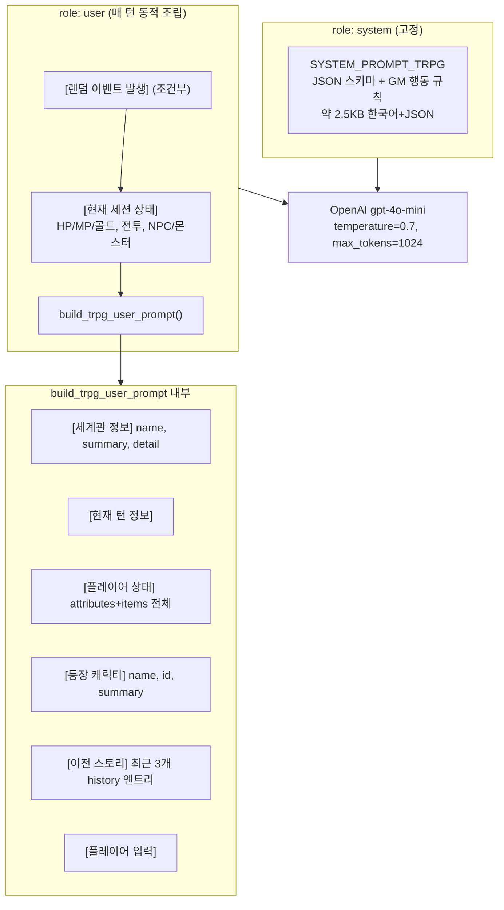

# TRPG 매 턴 LLM 컨텍스트 구성 분석 (Context Engineering)

작성일: 2026-06-14  
대상 레포: `F:/git/ai`  
관련 문서: [`trpg-llm-narrative-event-separation-analysis.md`](./trpg-llm-narrative-event-separation-analysis.md)  
문서 유형: 기술 분석 (티켓 비연동)

---

## 1. 요약 (질문에 대한 직접 답변)

게임 턴 API(`POST /v1/games/{game_id}/turn`)에서 LLM에 실제로 전달되는 메시지는 **2개**뿐이다.

```text
[
  { "role": "system", "content": SYSTEM_PROMPT_TRPG },
  { "role": "user",   "content": <조합된 user_prompt> }
]
```

| 질문 | 답 |
|------|-----|
| 룰북 전문이 매번 들어가는가? | **아니오.** `rules`(주사위·데미지·크리티컬·이벤트 확률 등)는 **서버 전용**이며 LLM 프롬프트에 포함되지 않는다. |
| 세션 상태는 어느 수준까지? | **요약 수준:** 턴 번호, HP/MP/골드(플레이어·NPC·몬스터), 전투 여부. 플레이어 `attributes`는 dict **전체를 문자열로** 삽입. |
| 대화 히스토리는 몇 턴? | **의도는 최근 3턴** (`story_history[-3:]`). 다만 현재 변환 로직상 **턴 단위가 아니라 로그 라인 3개**에 가깝게 동작할 수 있다 (§5.3). |
| `engine_input`의 history 20턴은? | `game_turn.py`에 조립되지만 **LLM에 전달되지 않는 미사용 코드**다 (§4.4). |

설계 의도(추론): **고정 system prompt로 출력 JSON 스키마를 유지**하고, **user 쪽은 세계관 스냅샷 + 짧은 히스토리 + 현재 스탯**만 넣어 토큰·비용을 제한한다. 수치 규칙(룰북)은 LLM이 아니라 **서버(`game_events.py`)가 실행**한다.

---

## 2. 실제 LLM 호출 구조

구현: `apps/api/routes/game_turn.py` (L419–422), `apps/llm/prompts/trpg_game_master.py`



---

## 3. System 메시지 (`SYSTEM_PROMPT_TRPG`)

**매 턴 동일하게 전송**되는 고정 블록이다.

### 3.1 포함 내용

| 블록 | 내용 | 대략적 역할 |
|------|------|------------|
| 역할 정의 | TRPG GM, JSON만 출력 | 역할 고정 |
| 출력 JSON 스키마 | `narration`, `dialogues`, `status_changes`, `updated_combat` | 구조화 출력 강제 |
| 필드별 규칙 | narration 200자, speaker_id, delta 의미 등 | 품질·일관성 |
| 세션 참조 지시 | `session_state`, `history` 배열을 고려하라는 문구 | user 블록과 연결 |

### 3.2 포함되지 않는 것

- 세계관·캐릭터·현재 HP 등 **게임별 동적 데이터**
- `rules` / 룰북 (주사위, 데미지 공식)
- 실제 대화 히스토리 본문

→ 동적 정보는 전부 **user 메시지 한 덩어리**에 넣는 **single-turn injection** 패턴이다. OpenAI Chat API의 multi-turn `assistant` 히스토리를 쓰지 않는다.

---

## 4. User 메시지 조립 순서

`game_turn.py`에서 최종 `user_prompt`는 아래 순서로 **문자열 접두**된다.

```text
1. [랜덤 이벤트 발생]     ← event_result 있을 때만
2. [현재 세션 상태]       ← session_state_text (수동 포맷)
3. build_trpg_user_prompt() 결과
```

### 4.1 `[랜덤 이벤트 발생]` (조건부)

`maybe_trigger_random_event()`가 전투 이벤트를 반환했을 때만 추가.

```text
종류: combat
적 타입: monsters
적들: 슬라임, 고블린
```

LLM에게 “이번 턴 서버가 이미 전투를 시작했다”는 맥락만 전달한다. 확률·주사위 값은 `game_doc.rules.events`로 **서버가 이미 판정**한 뒤 결과만 넘긴다.

### 4.2 `[현재 세션 상태]` (`session_state_text`)

`GameSessionSnapshot`에서 **읽기 쉬운 요약**으로 재작성한다.

| 항목 | 포함 필드 |
|------|----------|
| 공통 | `turn`, 플레이어 HP/MP/골드, 전투 중 여부 |
| NPC | `name`, `id`, HP/MP (등록된 NPC마다 1줄) |
| 몬스터 | 전투 중일 때 `name`, HP (monsters 배열) |

**포함 안 됨:** 인벤토리 목록, 페르소나, 게임 제목, `rules` 수치.

### 4.3 `build_trpg_user_prompt()` 본문

구현: `apps/llm/prompts/trpg_game_master.py`

#### (A) 세계관 정보

```text
이름: {world_snapshot.name}
요약: {world_snapshot.summary}
상세: {world_snapshot.scenario_detail ?? summary}
```

**데이터 출처:** `games.world_snapshot` (게임 생성 시 `worlds` 컬렉션에서 **스냅샷**으로 복사)

`WorldSnapshot` 모델 필드: `id`, `name`, `summary`, `tags`, `image_url`, `img_hash`  
→ **`scenario_detail` 필드는 world_snapshot에 없음.** `worlds`의 장문 설정 전문도 매 턴 들어가지 않는다.

게임 생성 시 사용자가 입력한 `scenario_detail`은 `games.scenario_detail`에 저장되지만, **현재 턴 프롬프트 빌더는 이 값을 읽지 않는다.**

#### (B) 플레이어 상태

```python
user_text = f"속성: {user_attrs}\n아이템: {user_items}"
```

`user_info.attributes`·`items` dict를 **Python repr 그대로** 삽입한다.  
예: `hp`, `mp`의 `current`/`max`/`base` 전체가 문자열로 포함된다.

#### (C) 등장 캐릭터 (`characters_info`)

캐릭터당 1줄:

```text
- {name} (ID: {char_ref_id}): {snapshot.summary}
```

**포함 안 됨:** `longBio`, `background`, `system_prompt`, `archetype`, `tags`, 이미지 URL.

#### (D) 이전 스토리 히스토리

```python
recent = story_history[-3:]
```

각 엔트리:

```text
턴 N: {narration}
  - {speaker}: {text}
```

**의도:** 최근 **3턴** 분량만 포함해 토큰 절약 + 최근 맥락 유지.

#### (E) 플레이어 입력

```text
"{user_message}"
```

---

## 5. 히스토리·세션 관련 주의사항

### 5.1 문서/코드 불일치: `engine_input` (미사용)

`game_turn.py` L348–364에서 아래 dict를 만든다.

```python
engine_input = {
    "world": world_snapshot,
    "game_meta": { "id", "title", "ruleset": game_doc.rules },
    "session_state": { turn, player, npcs, combat },
    "history": session.turn_logs[-20:],  # 최근 20
    "user_input": payload.user_message,
    "event": event_result,
}
```

이 객체는 **이후 어디에도 사용되지 않는다.** LLM 호출 직전에 `messages = [system, user]`만 전달한다.

→ 이전 분석 문서의 “history 20턴”은 **설계 초안 또는 미완 리팩터 흔적**이며, **실제 동작은 3 엔트리**다.

### 5.2 `story_history[-3:]` vs “3턴”

`build_trpg_user_prompt`는 `story_history` 배열을 사용한다.

세션 저장 시 `_convert_session_snapshot_to_game_session()`은 `turn_logs` **로그 1줄당** `story_history` 엔트리 1개를 생성한다 (narration / player / npc 각각 분리).

따라서 한 턴에 로그가 4~5줄이면 `[-3:]`는 **최근 3개 로그 라인**(종종 1턴 미만)만 포함할 수 있다.

반면 DB에 턴 단위로 쌓인 `story_history`(narration + dialogues[])를 직접 읽는 경로도 있어, **히스토리 깊이가 코드 경로에 따라 달라질 수 있다.**

### 5.3 Multi-turn Chat API 미사용

게임 턴 경로는 이전 assistant 응답을 `messages`에 쌓지 않는다.  
과거 내용은 **user 블록 안의 텍스트 요약**으로만 전달한다.

장점: 매 호출이 독립적, 스키마 system prompt 중복 적용 용이  
단점: 긴 캠페인에서 오래된 맥락 소실, user 블록 비대화 가능

---

## 6. 룰북(`rules`) — LLM에 안 가는 이유와 실제 사용처

게임 생성 시 `GameRulesConfig`가 MongoDB `games.rules`에 저장된다.

### 6.1 rules 구조 (예: `create/game.html`)

| 필드 | 예시 값 | 용도 |
|------|---------|------|
| `success_base` | 60 | 성공 기준 (LLM 미전달) |
| `difficulty_mod` | easy/normal/hard | 난이도 보정 |
| `ability_scale` | 1.0 | 능력치 스케일 |
| `attributes` | hp/mp 등 enabled/max/base | 세션 초기 스탯 |
| `dice` | count:5, faces:20 | 주사위 설정 |
| `damage` | str_multiplier, flat_bonus… | 데미지 공식 |
| `critical` | threshold_ratio, multiplier… | 크리 규칙 |
| `events` | base_chance, combat_weights… | 랜덤 전투 이벤트 |

### 6.2 서버에서만 사용

| 모듈 | rules 사용 |
|------|-----------|
| `game_events.py` | `rules.events` → 전투 발생 확률·적 타입 가중치 |
| `games.py` (세션 생성) | `rules.attributes` → 초기 HP/MP |
| `game_turn.py` | **LLM 프롬프트에 미포함** (`engine_input.game_meta.ruleset`도 미사용) |

**결론:** “룰북 전문”은 매 턴 LLM에 들어가지 않는다. LLM은 프롬프트의 **자연어 GM 규칙**과 **JSON 스키마**만 따르고, 수치 메카닉은 서버·(부분적으로) LLM이 `status_changes` delta로 **결과만** 기록한다.

---

## 7. 세션 상태 포함 수준 정리

| 데이터 | LLM 전달 | 형태 | 비고 |
|--------|---------|------|------|
| 턴 번호 | ✅ | 정수 | |
| 플레이어 HP/MP/골드 | ✅ | 요약 + attributes dict | 이중 표현 |
| NPC HP/MP | ✅ | 1줄 요약 | |
| 몬스터 HP | ✅ | 전투 시만 | |
| 인벤토리 아이템 목록 | △ | `items` dict (대개 gold만) | inventory는 보통 `[]` |
| 전투 phase | △ | 평화/전투 중 문구만 | `phase` enum 미전달 |
| 페르소나 | ❌ | — | 세션에 있으나 프롬프트 미포함 |
| 게임 title | ❌ | — | |
| scenario_summary/detail | ❌ | — | game 문서에만 존재 |
| rules 전체 | ❌ | — | 서버 전용 |
| world tags / image | ❌ | — | |

---

## 8. 레거시 `/v1/chat/` TRPG 컨텍스트 (비교)

캐릭터·세계관 채팅: `apps/api/routes/app_chat.py`

| 항목 | 게임 턴 API | 채팅 TRPG API |
|------|------------|--------------|
| 메시지 구조 | system 1 + user 1 | system 1 + **history N** + user 1 |
| System 내용 | JSON GM 스키마 | `SYS_TRPG` / `SYS_TRPG_NOCHOICE` (장면 문체 규칙) |
| 히스토리 | user 블록 내 텍스트, **~3 엔트리** | `MAX_TURNS_TRPG=3` → **최근 3턴×2=6 메시지** |
| 캐릭터 프로필 | summary만 (게임 NPC) | system에 `char_ctx` + `char_rules` (longBio, system_prompt 등) |
| 페르소나 | 미포함 | system에 persona_name/gender |
| RAG 컨텍스트 | 없음 | **의도적 OFF** (`context=""`) |
| 게임 rules/스탯 | 없음 | 없음 |

채팅 TRPG는 **캐릭터 롤플레이·문체**에 컨텍스트를 쓰고, 게임 턴은 **세션 스탯·JSON 출력**에 맞춘다.

---

## 9. 구성 결정 배경 (코드·구조로부터 읽히는 의도)

명시적 ADR 문서는 없으나, 구현 패턴으로 다음을 추론할 수 있다.

### 9.1 고정 System + 단일 User blob

- **이유:** JSON 출력 스키마를 매 턴 동일하게 강제; 파싱 파이프라인(`GameTurnLLMResponse`)과 결합
- **트레이드오프:** Chat history API 대신 요약 injection → 구현 단순, 토큰 예측 가능

### 9.2 세계관은 생성 시점 스냅샷

- **이유:** `world_snapshot`만 전달 → 월드 DB 재조회·전문 동기화 불필요
- **트레이드오프:** `summary` 수준만 유지; 장문 설정·게임별 `scenario_detail` 누락

### 9.3 히스토리 3개로 제한

- **이유:** `story_history[-3:]` — 비용·latency 절감 (`max_tokens=1024` 출력과 맞춤)
- **트레이드오프:** 장기 서사 연속성 약화; `engine_input` 20턴 설계는 미적용

### 9.4 Rules는 서버 실행

- **이유:** 확률·주사위를 코드로 통제 (`game_events.py`); LLM 환각으로 규칙 위반 방지
- **트레이드오프:** LLM이 damage 공식을 “모름” → `status_changes`를 LLM 재량에 맡김

### 9.5 RAG 비활성 (채팅 경로)

`app_chat.py`: `context = ""` — 성능 이슈 파악을 위해 검색 OFF 주석

---

## 10. 토큰·파라미터 참고

| 파라미터 | 값 | 위치 |
|----------|-----|------|
| model | `gpt-4o-mini` | `game_turn.py` |
| temperature | `0.7` | 동일 |
| max_tokens (출력) | `1024` | 동일 |
| 입력 토큰 상한 | **코드에 명시 없음** | 모델 컨텍스트 윈도우에 의존 |

입력 크기는 대략:

- System: ~2,000–2,500자 (고정)
- User: 세계관 summary + 캐릭터 수 × summary + attributes dict + 히스토리 3엔트리 + 유저 입력

캐릭터·attributes가 커지면 user 블록이 비선형으로 증가한다. **토큰 예산·트렁케이션 정책은 미구현.**

---

## 11. 관련 소스 파일

| 역할 | 경로 |
|------|------|
| System + user prompt 빌더 | `apps/llm/prompts/trpg_game_master.py` |
| 턴 API 조립·LLM 호출 | `apps/api/routes/game_turn.py` |
| 랜덤 이벤트 (rules 사용) | `apps/api/services/game_events.py` |
| rules 스키마 | `apps/api/models/games.py` |
| 게임 생성·rules 저장 | `apps/api/routes/games.py` |
| 레거시 TRPG 채팅 컨텍스트 | `apps/api/routes/app_chat.py` |
| 프론트 rules 입력 UI | `apps/web-html/create/game.html` |

---

## 12. 공백·개선 여지 (분석 관점)

1. **`engine_input` 정리** — 사용하거나 삭제; history 20 vs 3 혼란 제거
2. **히스토리 턴 단위 그룹핑** — `[-3:]`가 “3턴”이 되도록 `turn_logs` → 턴별 요약 변환
3. **`games.scenario_detail` 프롬프트 반영** — 게임 시나리오가 LLM에 전달되지 않음
4. **rules 요약 injection** — 전문 대신 “데미지는 STR×1.0” 등 1문단 요약만 선택 전달
5. **페르소나·인벤토리** — 세션에 있으나 LLM 미전달; 필요 시 opt-in
6. **토큰 예산 함수** — user 블록 조립 시 max length / 요약 LLM
7. **Chat history vs injection** — 장기 플레이 시 assistant 메시지 누적 전략 검토

---

## 13. 한 줄 결론

매 턴 LLM 컨텍스트는 **고정 JSON GM system prompt 1개**와, **랜덤 이벤트·HP 요약·세계관 summary·캐릭터 summary·최근 스토리 ~3덩어리·플레이어 입력**을 이어 붙인 **user 문자열 1개**로 구성된다. **룰북(rules) 전문은 들어가지 않으며**, 히스토리도 설계상 3턴 근처로 제한되나 **구현상 로그 3줄**에 가깝게 동작할 수 있다. `session_state + history 20` 형태의 `engine_input`은 **현재 LLM에 연결되지 않는다.**
