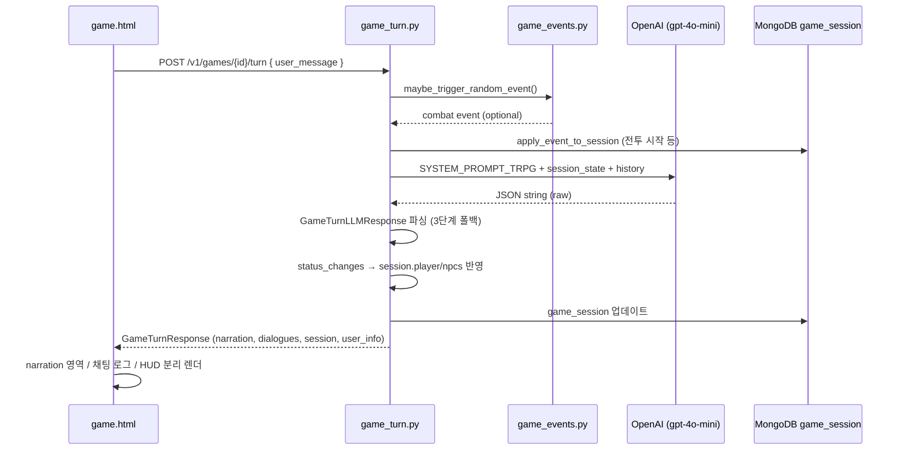

# TRPG LLM 응답: 서사 텍스트 vs 구조화 이벤트 데이터 분리 설계 분석

작성일: 2026-06-14  
대상 레포: `F:/git/ai`  
문서 유형: 기술 분석 (티켓 비연동)

---

## 1. 요약

현재 Arcanaverse TRPG는 **두 가지 LLM 응답 경로**가 공존한다.

| 경로 | 엔드포인트 | 서사/이벤트 분리 방식 |
|------|-----------|----------------------|
| **게임 턴 (신규/구조화)** | `POST /v1/games/{game_id}/turn` | LLM이 **단일 JSON**으로 `narration`·`dialogues`(서사)와 `status_changes`·`updated_combat`(이벤트)를 **필드 단위로 분리** 출력 → Pydantic 파싱 → 서버가 세션에 반영 |
| **채팅 TRPG (레거시/자유 텍스트)** | `POST /v1/chat/` (`mode: "trpg"`) | LLM이 **평문 장면 텍스트**만 반환 → `[선택지]` 블록은 정규식으로 추출 → **HP/데미지/경험치 등 구조화 이벤트 없음** |

질문하신 “고블린 처치 서사 + HP -10, 경험치 +50 동시 추출”은 **게임 턴 API 설계 의도**에 가깝다. 다만 **현재 구현은 HP/MP/골드 delta까지만 적용**되며, **경험치(exp) 필드는 스키마·프롬프트·적용 로직 어디에도 없다.**

핵심 설계 원칙은 **“LLM 출력을 처음부터 JSON 스키마로 강제하고, 파싱 실패 시에만 서사-only 폴백”** 이다. 서사 문장 안에서 숫자를 regex로 뽑아내는 방식은 사용하지 않는다.

---

## 2. 아키텍처 개요 (게임 턴 경로)



---

## 3. LLM 출력 스키마 (서사 vs 이벤트 필드)

프롬프트 정의: `apps/llm/prompts/trpg_game_master.py`  
Pydantic 스키마: `apps/api/schemas/game_turn.py`

LLM은 아래 JSON **만** 출력하도록 system prompt에서 강제한다 (`JSON 이외의 설명 텍스트는 절대 출력하지 마세요`).

### 3.1 서사(표현) 계층

| 필드 | 용도 | UI 표시 위치 |
|------|------|-------------|
| `narration` | 이번 턴 상황 요약 (2문장, 200자 이내) | `#game-narration` 노란 영역 |
| `dialogues[]` | 채팅창 대사·액션 | `#chat` 버블 (`speaker_type`, `is_action`) |

`dialogues` 항목 구조:

```json
{
  "speaker_type": "narration | player | npc | monster | system",
  "speaker_id": 123,
  "text": "실제 대사 또는 *액션*",
  "is_action": false
}
```

### 3.2 이벤트(게임 상태) 계층

| 필드 | 용도 | 예시 |
|------|------|------|
| `status_changes.user` | 플레이어 스탯 **변화량(delta)** | `hp_delta: -10`, `gold_delta: +50` |
| `status_changes.characters[]` | NPC별 변화량 | `char_ref_id` + delta |
| `updated_combat` | 전투 상태 스냅샷 | `in_combat`, `monsters[]`, `phase` |

`status_changes.user` 예시:

```json
{
  "hp_delta": -10,
  "mp_delta": 0,
  "items_add": ["고블린 이빨"],
  "items_remove": [],
  "gold_delta": 50
}
```

**중요:** delta는 “이번 턴 변화량”이며, 서사 텍스트에 “HP가 10 줄었다”고 써도 **반드시 `hp_delta`에도 기록**하도록 프롬프트가 요구한다. 서버는 서사 문장을 파싱하지 않고 **JSON 필드만 신뢰**한다.

### 3.3 예시: 한 턴 응답 전체

```json
{
  "narration": "고블린이 쓰러지며 동굴이 조용해집니다.",
  "dialogues": [
    {
      "speaker_type": "player",
      "speaker_id": null,
      "text": "*검을 거둔다*",
      "is_action": true
    },
    {
      "speaker_type": "npc",
      "speaker_id": 42,
      "text": "수고했어. 다음은 더 조심하자.",
      "is_action": false
    }
  ],
  "status_changes": {
    "user": {
      "hp_delta": -10,
      "mp_delta": -5,
      "items_add": ["낡은 단검"],
      "items_remove": [],
      "gold_delta": 20
    },
    "characters": []
  },
  "updated_combat": {
    "in_combat": false,
    "monsters": [],
    "phase": "end"
  }
}
```

> 참고: `경험치 +50`은 위 스키마에 **해당 필드가 없음**. 골드(`gold_delta`)로 대체 표현하거나, 후속 스키마 확장이 필요하다.

---

## 4. 백엔드 파싱 파이프라인

구현: `apps/api/routes/game_turn.py`

### 4.1 3단계 JSON 파싱 폴백

```text
1차: raw_response 그대로 GameTurnLLMResponse.model_validate_json()
2차: extract_json()으로 ```json``` 래퍼·앞뒤 잡텍스트 제거 후 재파싱
3차: build_fallback_llm_response() — 전체 텍스트를 narration으로만 사용, status_changes는 전부 0
```

`extract_json()` 동작:

- Markdown 코드 펜스(````json`) 제거
- 첫 `{` ~ 마지막 `}` 구간만 슬라이스

### 4.2 파싱 후 처리 흐름

1. `turn_logs`에 플레이어 입력 → `narration` → `dialogues` 순으로 적재
2. `status_changes`를 `GameSessionSnapshot`에 반영:
   - `player.hp += hp_delta` (0 ~ hp_max 클램프)
   - `player.mp`, `player.gold` 동일
   - NPC는 `char_ref_id` 매칭 후 동일
3. `updated_combat`으로 전투 상태·몬스터 목록 갱신
4. MongoDB `game_session` 컬렉션에 저장
5. `GameTurnResponse`로 프론트에 **이미 반영된** `user_info` + `session` 전달

### 4.3 LLM 이전: 서버 측 랜덤 이벤트

`apps/api/services/game_events.py`

LLM과 **별도**로, 매 턴 주사위(`roll`)로 전투 이벤트가 트리거될 수 있다.

- `maybe_trigger_random_event()` → `kind: "combat"`, `enemies[]` 생성
- `apply_event_to_session()` → `combat.in_combat = true`, `story_history`에 내레이션 추가
- 이벤트 정보는 LLM user prompt의 `[랜덤 이벤트 발생]` 블록으로 전달

즉 **이벤트 데이터 소스가 두 갈래**다:

| 소스 | 생성 주체 | 예시 |
|------|----------|------|
| 서버 랜덤 이벤트 | `game_events.py` (확률·주사위) | 갑작스러운 전투 시작 |
| LLM 구조화 응답 | `status_changes`, `updated_combat` | 턴 중 HP 변화, 전투 종료 |

---

## 5. 프론트엔드 분리 렌더링

주요 파일: `apps/web-html/game.html`, `apps/web-html/js/game_turn.js`

게임 페이지(`game.html?game=...`)는 `/v1/games/{id}/turn`을 호출한다.

| 데이터 | 소스 필드 | 렌더 함수 | UI |
|--------|----------|----------|-----|
| 상황 내레이션 | `session.turn_logs` 중 `speaker_type === 'narration'` | `#game-narration` | 상단 요약 박스 |
| 대화/액션 | `turn_logs` (narration 제외) | `renderChatLogsFromSession()` | 채팅 버블 |
| HP/MP/골드 | `session.player`, `session.npcs` | `renderHudFromSession()` | HUD 패널 |
| 스탯 변화 수치 | **직접 표시 안 함** | — | delta는 서버 적용 후 절대값만 HUD에 표시 |

프론트는 `status_changes`를 **직접 읽지 않는다**. 백엔드가 세션에 반영한 `session.player.hp` 등 **결과 스냅샷**만 사용한다.

`game_turn.js`는 동일 API를 호출하며 `data.narration`, `data.dialogues`, `data.user_info`를 각 영역에 매핑하는 단순 경로도 제공한다.

---

## 6. 레거시 `/v1/chat/` TRPG 경로 (구조화 이벤트 없음)

구현: `apps/api/routes/app_chat.py`

캐릭터 채팅(`chat.html`), 세계관 채팅(`world.html`) 등에서 `mode: "trpg"`로 호출한다.

### 6.1 출력 형식

System prompt가 **평문 장면**을 요구한다:

```text
(배경/상황 묘사 2~4문장 + NPC 대사)
[선택지]   ← choices > 0 일 때만
- 선택지 1
- 선택지 2
```

### 6.2 후처리

`postprocess_trpg()`:

- `[선택지]` 이후 블록을 regex로 잘라 `choices[]` 추출
- 본문은 `refine_ko`, 불릿→장면 변환 등 **문장 품질** 후처리
- 선택적으로 `polish()` 2차 LLM 호출

### 6.3 응답

```json
{ "trace_id": "...", "answer": "<장면 텍스트>", "sid": "..." }
```

**HP, 데미지, 아이템, 경험치 필드 없음.** 서사와 게임 메카닉이 분리되지 않는다.

---

## 7. 두 경로 비교

| 항목 | 게임 턴 API | 채팅 TRPG API |
|------|------------|--------------|
| 엔드포인트 | `/v1/games/{id}/turn` | `/v1/chat/` |
| LLM 출력 | JSON only | 자유 텍스트 |
| 서사 분리 | `narration` + `dialogues` | `answer` 단일 문자열 |
| 스탯/이벤트 | `status_changes`, `updated_combat` | 없음 |
| 세션 저장 | `game_session` (MongoDB) | 채팅 히스토리 / 인메모리 세션 |
| 프롬프트 | `trpg_game_master.py` | `SYS_TRPG` / `SYS_TRPG_NOCHOICE` |
| 파싱 실패 시 | narration 폴백, delta=0 | N/A |

---

## 8. 현재 구현의 공백·제한사항

분석 시 확인된 **설계 대비 미완/불일치** 항목:

### 8.1 경험치(exp) 미구현

- 스키마, 프롬프트, 세션 모델, HUD 어디에도 `exp` / `experience` 필드 없음
- “경험치 +50”은 현재 코드로는 표현·적용 불가

### 8.2 아이템 delta 스키마만 존재, 턴 API 미적용

- `items_add` / `items_remove`는 `GameTurnLLMResponse`·프롬프트에 정의됨
- `game_turn.py`의 상태 반영 구간은 **hp/mp/gold만** 처리
- `inventory`는 응답에서 항상 `[]`로 내려감
- 완전한 아이템 적용 로직은 **deprecated** `apps/api/services/game_status_service.py`의 `apply_status_changes()`에만 존재

### 8.3 서사–스탯 불일치 가능성

- LLM이 narration에 “HP -10”을 쓰고 `hp_delta: 0`을 반환하면 **HUD는 변하지 않음**
- 검증·보정 레이어(서사 vs delta 교차검증) 없음

### 8.4 JSON 파싱 실패 폴백

- 3차 폴백 시 **이벤트 데이터 전부 소실** (delta=0)
- 서사만 표시되고 전투/데미지가 반영되지 않을 수 있음

### 8.5 이중 TRPG 모델 공존

- `game.html`은 구조화 턴 API 사용
- `chat.html` / `world.html`은 레거시 텍스트 TRPG
- 동일 “TRPG”라도 **기능 수준이 다름**

---

## 9. 관련 소스 파일 인덱스

| 역할 | 경로 |
|------|------|
| GM system prompt (JSON 스키마 정의) | `apps/llm/prompts/trpg_game_master.py` |
| 요청/응답 Pydantic 모델 | `apps/api/schemas/game_turn.py` |
| 턴 API · JSON 파싱 · 세션 반영 | `apps/api/routes/game_turn.py` |
| 서버 랜덤 전투 이벤트 | `apps/api/services/game_events.py` |
| (deprecated) 아이템 포함 상태 적용 | `apps/api/services/game_status_service.py` |
| 레거시 TRPG 채팅 | `apps/api/routes/app_chat.py` |
| 게임 UI (HUD·내레이션·채팅) | `apps/web-html/game.html` |
| 게임 턴 JS 헬퍼 | `apps/web-html/js/game_turn.js` |

---

## 10. 결론

**질문에 대한 직접 답변:**

> LLM 응답 하나에서 서사와 구조화 이벤트를 어떻게 구분하는가?

**게임 턴 TRPG**에서는 LLM에게 **단일 JSON 객체**를 출력하게 하고, 필드 이름으로 역할을 분리한다.

- **서사:** `narration`, `dialogues`
- **이벤트:** `status_changes` (HP/MP/골드/아이템 delta), `updated_combat`

백엔드는 Pydantic으로 파싱한 뒤 이벤트 필드만 세션에 수치 반영하고, 프론트는 반영된 세션 스냅샷을 UI 영역별로 나눠 그린다. **자연어에서 숫자를 추출하는 2차 파싱은 하지 않는다.**

다만 **경험치는 아직 설계·구현되지 않았고**, 아이템 delta는 스키마에만 있고 턴 API 적용이 빠져 있다. 캐릭터/세계관 채팅 TRPG는 여전히 **서사 전용 평문** 모델이다.

---

## 11. 후속 개선 방향 (참고, 미구현)

티켓 없이 분석 관점에서만 제시:

1. `status_changes`에 `exp_delta` 추가 + HUD 표시
2. `game_turn.py`에 `items_add`/`items_remove` 적용 (`game_status_service` 로직 이관)
3. JSON 파싱 실패율 모니터링 + structured output / function calling 검토
4. 레거시 `/v1/chat/` TRPG와 게임 턴 API의 역할 문서화·통합 로드맵
