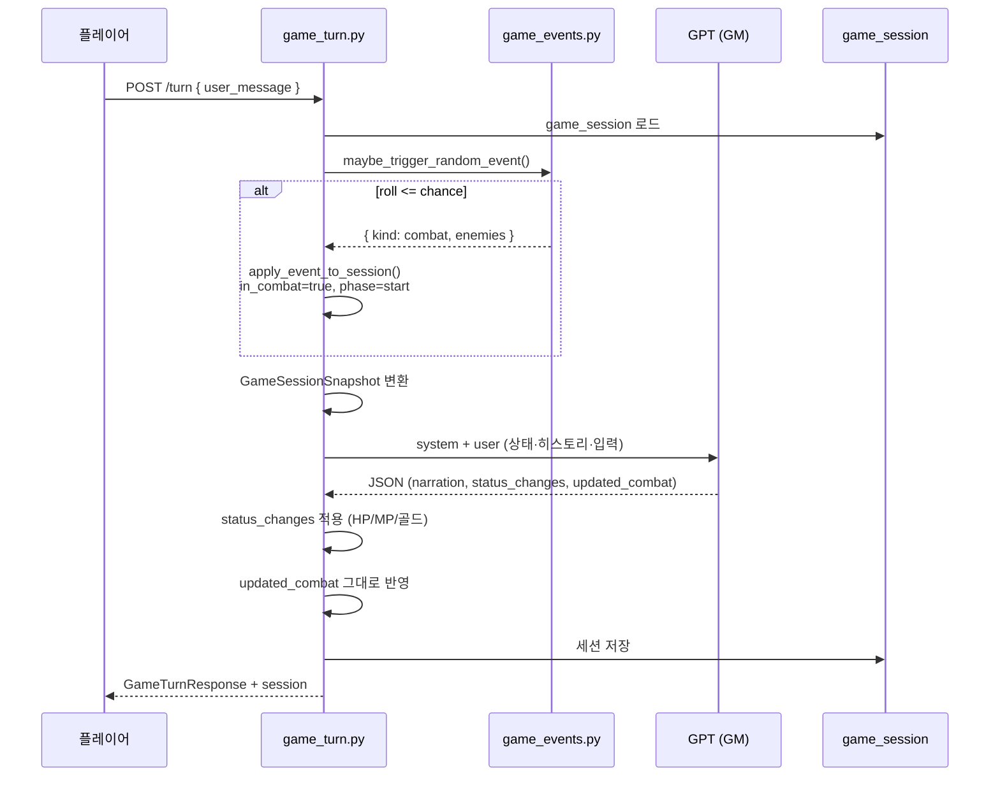
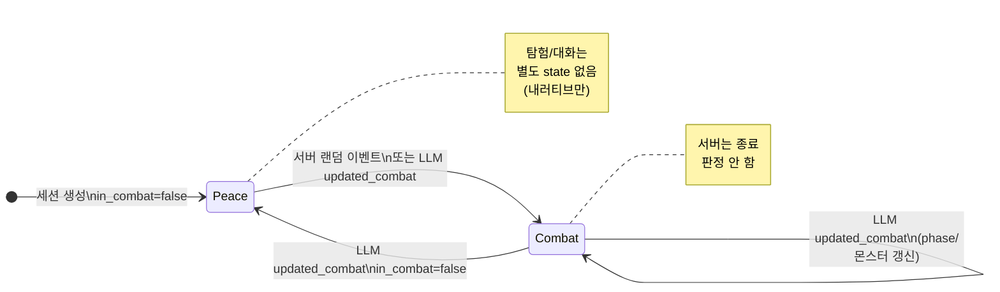

# TRPG 게임 상태 전환·State Machine·Agent Workflow 분석

작성일: 2026-06-14  
대상 레포: `F:/git/ai`  
관련 문서:
- [`trpg-llm-narrative-event-separation-analysis.md`](./trpg-llm-narrative-event-separation-analysis.md)
- [`trpg-llm-context-engineering-analysis.md`](./trpg-llm-context-engineering-analysis.md)  
문서 유형: 기술 분석 (티켓 비연동)

---

## 1. 요약 (질문에 대한 직접 답변)

| 질문 | 답 |
|------|-----|
| 전투/탐험/대화 상태를 어떻게 관리하는가? | **명시적 State Machine 없음.** 세션의 `combat.in_combat` 불린과 `combat.phase` 문자열 정도만 존재하며, **「탐험 중」「대화 중」 전용 상태 enum·전환 규칙은 구현되어 있지 않다.** 평시는 프롬프트에서 **「평화」** 로만 표현된다. |
| 「전투가 끝났다」 판단 주체는? | **사실상 LLM.** 서버는 `updated_combat.in_combat === false` 를 **검증 없이 그대로 반영**한다. 몬스터 HP 0·플레이어 생존 등 **종료 조건을 코드로 판정하지 않는다.** |
| State Machine인가, LLM 값 신뢰인가? | **후자에 가깝다.** `updated_combat`이 있으면 `in_combat` / `phase` / `monsters[]` 를 **무조건 덮어쓴다**(유효 전이 검사 없음). 예외적으로 **전투 시작**만 서버 `game_events.py`가 확률적으로 먼저 걸 수 있다. |

한 줄로: **「이중 권한(서버 시작 + LLM 종료/갱신)」의 느슨한 전투 플래그**이지, 탐험/대화/전투를 정의한 FSM이 아니다.

---

## 2. 코드상 존재하는 「게임 상태」

### 2.1 스키마 (`CombatState`)

`apps/api/schemas/game_turn.py`

```python
class CombatState(BaseModel):
    in_combat: bool = False
    monsters: List[CharacterState] = []
    phase: Literal["none", "start", "player_turn", "npc_turn", "end"] = "none"
```

세션 초기값 (`games.py` 세션 생성):

```python
"combat": {
    "in_combat": False,
    "monsters": [],
    "phase": "none",
}
```

### 2.2 실제로 쓰이는 상태 축

| 축 | 저장 위치 | 서버 로직 | 프론트 | LLM 프롬프트 |
|----|----------|----------|--------|-------------|
| **전투 여부** | `combat.in_combat` | 시작(이벤트), 갱신(LLM) | 페르소나 변경 확인만 | 「전투 중 / 평화」 |
| **전투 단계** | `combat.phase` | 시작 시 `"start"` 한 번 | **미사용** | 스키마에만 정의 |
| **몬스터 목록** | `combat.monsters[]` | 이벤트·LLM 덮어쓰기 | HUD에 미표시 | 전투 중 요약 텍스트 |
| 탐험/지역 | `get_area_type()` | 항상 `"field"` (TODO) | 없음 | 없음 |
| 대화 모드 | — | **없음** | 없음 | dialogues로만 표현 |

→ 사용자가 말하는 **「탐험 중 / 대화 중」** 은 별도 state가 아니라, `in_combat == false` 일 때 LLM이 생성하는 **내러티브**에 해당한다.

---

## 3. Agent Workflow (매 턴 파이프라인)

구현: `apps/api/routes/game_turn.py` — `play_turn()`



### 단계별 책임

| 단계 | 주체 | 하는 일 |
|------|------|---------|
| 1. 세션 로드 | 서버 | MongoDB `game_session` |
| 2. 랜덤 이벤트 | **서버** | `rules.events` 확률로 전투 **시작** 가능 |
| 3. 스냅샷 변환 | 서버 | `story_history` → `turn_logs` 등 |
| 4. 프롬프트 조립 | 서버 | 현재 `in_combat`, HP, 몬스터 요약 |
| 5. LLM 호출 | LLM | JSON 턴 결과 생성 |
| 6. 스탯 반영 | 서버 | `status_changes` delta 적용 (클램프만) |
| 7. 전투 상태 반영 | 서버 | **`updated_combat` 필드 신뢰·복사** |
| 8. 저장·응답 | 서버 | DB upsert, 프론트에 session |

**턴 카운터:** 랜덤 이벤트가 있으면 `apply_event_to_session`이 turn을 +1 하고, 없으면 LLM 처리 후 `session.turn += 1` (이벤트 턴과 플레이어 턴 증가 규칙이 분기됨).

---

## 4. 상태 전환 — 누가 무엇을 바꾸는가

### 4.1 전투 시작

**경로 A — 서버 랜덤 이벤트** (`game_events.py`)

```python
session["combat"]["in_combat"] = True
session["combat"]["phase"] = "start"
session["combat"]["monsters"] = event["enemies"]  # {name, hp, attack} 형태
```

- 매 턴 `maybe_trigger_random_event()` 호출
- `in_combat` 여부 **확인 없이** 재롤 가능 (이미 전투 중이어도 또 트리거될 수 있음)
- `get_area_type()`은 `"field"` 고정 → `rules.events.area_mod` 의미 제한적

**경로 B — LLM `updated_combat`**

프롬프트 (`trpg_game_master.py`):

> 전투가 시작되면 in_combat을 true로, monsters 배열에 몬스터 정보를 추가하세요.

서버는 LLM이 `in_combat: true` 를 주면 **동일하게 반영**한다.

### 4.2 전투 진행 중 (`phase`)

스키마·프롬프트에 `none | start | player_turn | npc_turn | end` 가 있으나:

| phase 값 | 서버가 설정하는 곳 | 서버가 소비하는 곳 |
|----------|-------------------|-------------------|
| `none` | 초기 세션 | 없음 |
| `start` | `apply_event_to_session` only | 없음 |
| `player_turn` | — | **없음** |
| `npc_turn` | — | **없음** |
| `end` | — | **없음** |

`game_turn.py` 적용 코드:

```python
session.combat.phase = combat_data.get("phase", session.combat.phase)
```

→ **저장만 하고, 입력 허용·AI 턴 순서·UI 분기에 사용하지 않는다.**  
명시적 FSM transition table **없음**.

### 4.3 전투 종료

**판정 주체: LLM (프롬프트 지시)**

> 전투가 종료되면 in_combat을 false로, monsters를 빈 배열로 설정하세요.

**서버 종료 로직: 없음**

- 몬스터 `hp <= 0` 자동 체크 없음
- `status_changes`로 몬스터 HP를 깎아도 `combat.monsters` 와 **연동 없음**
- `phase == "end"` → `in_combat = false` 강제 변환 없음
- 전투 종료 후 보상·경험치 트리거 없음

적용 코드:

```python
if llm_data.updated_combat:
    session.combat.in_combat = combat_data.get("in_combat", session.combat.in_combat)
    if "monsters" in combat_data:
        session.combat.monsters = [...]  # LLM 배열 전체 교체
```

→ **「전투가 끝났다」= LLM이 JSON에서 `in_combat: false` 를 줬을 때** (서버는 내러티브와 교차검증하지 않음).

### 4.4 「탐험 / 대화」 (비전투)

별도 state 없음. `in_combat == false` 이면:

- 프롬프트: `전투 상태: 평화`
- LLM이 narration/dialogues로 탐험·NPC 대화를 **텍스트로** 묘사
- 서버는 모드 전환을 기록하지 않음

---

## 5. State Machine 여부 — 구조적 결론

### 5.1 명시적 FSM이 아닌 근거

1. **상태 enum이 전투 블록에만** 있고 탐험/대화/상점 등 없음  
2. **`transition` 함수·허용 전이 테이블·guard 조건** 코드 없음  
3. **`phase` 값이 비즈니스 로직에 미연결** (저장·프롬프트 스키마 수준)  
4. **종료 조건이 LLM 출력에 위임** (`updated_combat` trust)  
5. **이중 writer**: 서버(이벤트)와 LLM이 같은 `combat` 필드를 각각 수정 가능  

### 5.2 실제 패턴 이름

| 패턴 | 이 레포에서의 해당 |
|------|-------------------|
| Explicit State Machine | ❌ |
| LLM-as-State-Writer | ✅ `updated_combat` |
| Server-as-Event-Injector | ✅ `game_events.py` (시작만) |
| Hybrid (권장 FSM + LLM 내러티브) | △ 의도는 스키마에 있으나 서버 검증 미완 |



다이어그램은 **개념 모델**이며, 코드에는 `Peace`/`Combat` enum이나 전이 검증기는 없다.

---

## 6. 권한 분리 (Dual Authority) 상세

| 이벤트 | 서버 | LLM | 검증 |
|--------|------|-----|------|
| 전투 시작 (랜덤) | ✅ `apply_event_to_session` | — | 확률만, `in_combat` 무시 |
| 전투 시작 (서사) | — | ✅ `updated_combat` | 없음 |
| 몬스터 HP 갱신 | — | ✅ `updated_combat.monsters` | 없음 |
| 플레이어 HP 변화 | — | ✅ `status_changes` | 0~max 클램프만 |
| 전투 종료 | — | ✅ `in_combat: false` | 없음 |
| phase 전환 | `start` 1회 | ✅ 임의 값 | 없음 |

**충돌 예시**

- 서버가 전투 시작 → 같은 턴 LLM이 `in_combat: false` 반환 → **즉시 평화로 덮어씀**
- 전투 중인데 서버가 또 랜덤 이벤트 성공 → **몬스터 목록·내레이션 중첩 가능**
- LLM이 몬스터 HP를 0으로 안 주고 내러티브만 「처치」→ **in_combat true 유지 가능**

---

## 7. 프론트엔드의 상태 소비

`apps/web-html/game.html`

```javascript
const inCombat = currentSession?.combat?.in_combat === true;
```

**유일한 게임플레이 분기:** 페르소나 변경 시 확인 다이얼로그.

- `phase` 미사용
- `monsters` HUD 미표시 (`renderHudFromSession`은 player/npcs만)
- 전투 UI(턴 순서, 행동 버튼) 없음
- 탐험/대화 모드 UI 없음

→ 프론트도 **FSM이 아니라 boolean 플래그 1개** 수준.

---

## 8. 구현상 결함·공백 (상태 일관성)

### 8.1 몬스터 스냅샷 로드 누락

`_convert_game_session_to_session_snapshot()`:

```python
combat = CombatState(
    in_combat=...,
    monsters=[],  # TODO: 몬스터 정보가 있으면 변환
    phase=...,
)
```

DB `game_session.combat.monsters` 가 있어도 **스냅샷 변환 시 항상 비움**.  
다음 턴 LLM 프롬프트의 「몬스터 상태」 블록이 비어 있을 수 있음 (LLM·`updated_combat`이 다시 채워야 함).

### 8.2 이벤트 몬스터 vs LLM 몬스터 스키마 불일치

서버 이벤트 적:

```json
{ "name": "고블린", "hp": 25, "attack": 5 }
```

LLM 스키마:

```json
{ "id", "name", "hp", "hp_max", "mp", "mp_max" }
```

`updated_combat` 반영 시 `id` 없으면 0, `hp_max` 없으면 100 등 **기본값 채움**.

### 8.3 `updated_combat` 선택적 필드

`GameTurnLLMResponse.updated_combat` 은 `Optional`. LLM이 생략하면 **이전 턴 전투 상태 유지** (종료도 서버가 강제하지 않음).

---

## 9. 레거시 `/v1/chat/` TRPG와 비교

| 항목 | 게임 턴 API | 채팅 TRPG |
|------|------------|----------|
| `combat` / `in_combat` | ✅ | ❌ |
| 서버 랜덤 전투 | ✅ | ❌ |
| 상태 저장 | MongoDB `game_session` | 인메모리 대화 히스토리 |
| 모드 | 전투 플래그만 | 무상태 장면 텍스트 |

채팅 TRPG에는 **게임 상태 머신 개념 자체가 없다.**

---

## 10. 설계 의도 추론 vs 현재 완성도

### 프롬프트·스키마가 암시하는 의도

- `phase`: 턴제 전투 루프 (`player_turn` → `npc_turn`)  
- `updated_combat`: 구조화된 전투 스냅샷  
- `game_events`: 서버가 확률적 인카운터 주입  

### 코드가 실제로 하는 일

- **전투 on/off 불린** + 몬스터 배열 문자열 보관  
- **phase·턴 순서·탐험 모드** 미구현  
- **종료·승패 판정 LLM 위임**  

→ **FSM 설계 초안 + LLM trust 모드**로 이해하는 것이 정확하다.

---

## 11. 관련 소스

| 역할 | 경로 |
|------|------|
| 턴 API·`updated_combat` 적용 | `apps/api/routes/game_turn.py` |
| 랜덤 전투 시작 | `apps/api/services/game_events.py` |
| `CombatState` 스키마 | `apps/api/schemas/game_turn.py` |
| LLM 전투 규칙 문구 | `apps/llm/prompts/trpg_game_master.py` |
| 세션 초기 combat | `apps/api/routes/games.py` |
| 프론트 `in_combat` 사용 | `apps/web-html/game.html` |

---

## 12. 후속 개선 방향 (참고)

명시적 FSM을 도입한다면 예시:

```text
States: EXPLORATION | COMBAT | DIALOGUE (optional)
Transitions:
  EXPLORATION --[server event roll]--> COMBAT
  EXPLORATION --[LLM + guard]--> DIALOGUE
  COMBAT --[all monsters hp<=0 OR LLM end + verify]--> EXPLORATION
Guards:
  - 서버: in_combat일 때 랜덤 인카운터 비활성
  - 서버: updated_combat.in_combat=false 시 monsters 전원 hp<=0 확인
```

현재는 위 Guards·States **없음**.

---

## 13. 한 줄 결론

**전투/탐험/대화 상태 전환은 State Machine으로 구현되어 있지 않다.** 서버는 `game_events.py`로 전투를 **확률적으로 시작**할 수 있고, **전투 종료·진행·몬스터 상태 갱신은 LLM의 `updated_combat`을 검증 없이 세션에 반영**한다. `phase`와 탐험/대화 모드는 스키마·프롬프트 수준에 머물며, **「전투가 끝났다」는 판단은 사실상 LLM 몫**이다.
