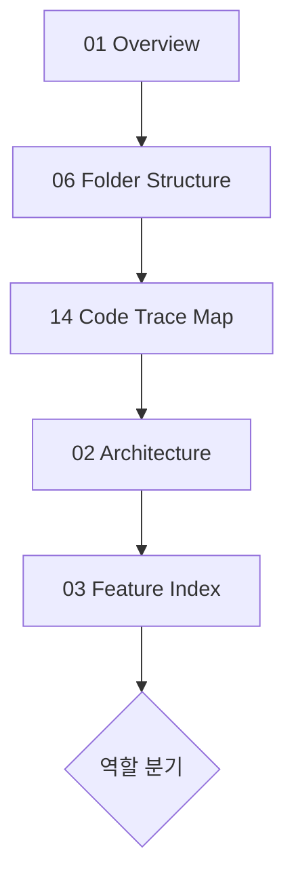

# Documentation Index

> Arcanaverse 프로젝트 문서 인덱스 (갱신: 2026-06-14)  
> **코드 기준** 개발 현황 문서 세트 + 기존 SSOT

---

## 1. 전체 문서 목록

### 1.1 번호 문서 (`docs/01`–`15`) — 개발 현황·온보딩

| # | 문서 | 목적 |
|---|------|------|
| 01 | [01_Project_Overview.md](../01_Project_Overview.md) | 프로젝트 목적, 스택, 실행, MVP 상태 |
| 02 | [02_Architecture.md](../02_Architecture.md) | 시스템·레이어·배포·호출 흐름 |
| 03 | [03_Feature_Index.md](../03_Feature_Index.md) | 도메인별 구현 현황 표 |
| 04 | [04_API_Documentation.md](../04_API_Documentation.md) | API + Frontend 연결 |
| 05 | [05_Database_Schema.md](../05_Database_Schema.md) | MongoDB 컬렉션·인덱스 |
| 06 | [06_Folder_Structure.md](../06_Folder_Structure.md) | 폴더 책임·필수 파일 |
| 07 | [07_AI_Workflow.md](../07_AI_Workflow.md) | LLM·프롬프트·상태 |
| 08 | [08_Game_Flow.md](../08_Game_Flow.md) | 게임 생성→플레이 시퀀스 |
| 09 | [09_Tech_Debt.md](../09_Tech_Debt.md) | 기술 부채·리스크 |
| 10 | [10_TODO_and_Roadmap.md](../10_TODO_and_Roadmap.md) | TODO·P0/P1/P2 |
| 11 | [11_README_Draft.md](../11_README_Draft.md) | GitHub README 초안 |
| 12 | [12_Development_Status_Report.md](../12_Development_Status_Report.md) | 개발 현황 리포트 |
| 13 | [13_TRPG_Engine.md](../13_TRPG_Engine.md) | **TRPG 엔진 핵심** |
| 14 | [14_Code_Trace_Map.md](../14_Code_Trace_Map.md) | **기능별 코드 추적표** |
| 15 | [15_MVP_Scope.md](../15_MVP_Scope.md) | **MVP 범위 재정의** |

### 1.2 심층 분석 (`docs/analysis/`)

| 문서 | 목적 |
|------|------|
| [trpg-llm-narrative-event-separation-analysis.md](trpg-llm-narrative-event-separation-analysis.md) | 서사 vs 이벤트 JSON |
| [trpg-llm-context-engineering-analysis.md](trpg-llm-context-engineering-analysis.md) | 매 턴 LLM 컨텍스트 |
| [trpg-state-machine-agent-workflow-analysis.md](trpg-state-machine-agent-workflow-analysis.md) | 전투 상태·FSM |
| [v1-recovery-status-report.md](v1-recovery-status-report.md) | 배포·복구 상태 |
| [README.md](README.md) | analysis 폴더 규칙 |

### 1.3 SSOT·운영 (기존 유지)

| 문서 | 목적 |
|------|------|
| [SSOT.md](../SSOT.md) | **정책·구조 SSOT** |
| [ARCHITECTURE.md](../ARCHITECTURE.md) | 아키텍처 (기존) |
| [AI_ENTRYPOINT.md](../AI_ENTRYPOINT.md) | AI 작업 시작 |
| [AI_AGENT_RULES.md](../AI_AGENT_RULES.md) | AI 에이전트 규칙 |
| [DEVELOPMENT_GUIDE.md](../DEVELOPMENT_GUIDE.md) | 개발 워크플로 |
| [QA_AND_DONE.md](../QA_AND_DONE.md) | DoD·리포트 규칙 |
| [tickets/](../tickets/) | 티켓 |

---

## 2. SSOT vs 번호 문서 우선순위

| 주제 | 우선 문서 | 비고 |
|------|----------|------|
| **정책·워크플로·문서 규칙** | `SSOT.md`, `AI_AGENT_RULES.md` | 번호 문서와 충돌 시 **정책은 SSOT** |
| **코드 구현 현황·API·DB 스냅샷** | `01`–`15` 번호 문서 | **코드 기준 최신** |
| **아키텍처 목표** | `SSOT.md`, `ARCHITECTURE.md` | Route→Usecase→Adapter |
| **아키텍처 현실** | `02`, `14`, `ROUTES_DIRECT_MONGO_ACCESS.md` | direct Mongo 다수 |
| **TRPG 엔진** | `13`, `analysis/trpg-*.md` | |
| **티켓 작업** | `docs/tickets/` + `QA_AND_DONE.md` | |

---

## 3. 권장 읽기 순서 (공통)

---

## 4. 역할별 읽기 경로

### 4.1 신규 개발자 (전체)

1. `01_Project_Overview` → `06_Folder_Structure` → `14_Code_Trace_Map`
2. `02_Architecture` → `03_Feature_Index`
3. 담당 영역 문서 → `SSOT.md` → `DEVELOPMENT_GUIDE.md`

### 4.2 프론트엔드

1. `06` → `14` (Character/Chat/Game 행)
2. `apps/web-html/js/config.js`, `static/js/session.js`
3. `04_API_Documentation` (호출 API)
4. `08_Game_Flow`

### 4.3 백엔드

1. `02` → `04` → `05`
2. `apps/api/main.py`, `routes/`, `schemas/`
3. `14` → `docs/architecture/ROUTES_DIRECT_MONGO_ACCESS.md`
4. `09`, `10`

### 4.4 AI / LLM

1. `07_AI_Workflow` → `13_TRPG_Engine`
2. `analysis/trpg-llm-*.md` (3종)
3. `apps/llm/prompts/trpg_game_master.py`, `game_turn.py`, `app_chat.py`

### 4.5 운영 / 배포

1. `01` (환경변수) → `02` (Docker/Nginx)
2. `infra/README-OPERATIONS.md`, `infra/docker-compose.yml`
3. `12`, `15` (리스크)
4. `.github/workflows/deploy-dev.yml`

### 4.6 PM / 면접·포트폴리오

1. `01` → `12` → `15`
2. `13` (엔진 차별점)
3. `03` (기능 표)
4. `11_README_Draft`

---

## 5. 문서 갱신 규칙

| 규칙 | 내용 |
|------|------|
| 코드 변경 시 | 관련 번호 문서 + `14_Code_Trace_Map` 갱신 |
| 티켓 완료 시 | `docs/analysis/{TICKET-ID}_report.md` (`QA_AND_DONE.md`) |
| 정책 변경 시 | `SSOT.md` 먼저, 번호 문서에 「SSOT 정책」 참조 |
| 추측 금지 | 확인 안 되면 「확인 필요」 |
| 덮어쓰기 | SSOT 원본 삭제 금지; 번호 문서는 **보강** 우선 |
| 신규 엔진 문서 | `13_TRPG_Engine.md`를 canonical로 |

---

## 6. 빠른 참조

| 질문 | 문서 |
|------|------|
| API URL은? | `04`, `apps/api/main.py` |
| 프론트가 어떤 API 호출? | `14`, `config.js` |
| Mongo 컬렉션? | `05` |
| LLM 프롬프트? | `07`, `13` |
| MVP에 뭐 넣나? | `15` |
| 뭘 고쳐야 하나? | `09`, `10` |
| 게임 한 판 흐름? | `08`, `13` |

---

## 분석 기준 파일

- `docs/01`–`docs/15` 전체
- `docs/SSOT.md`, `apps/api/`, `apps/web-html/`
