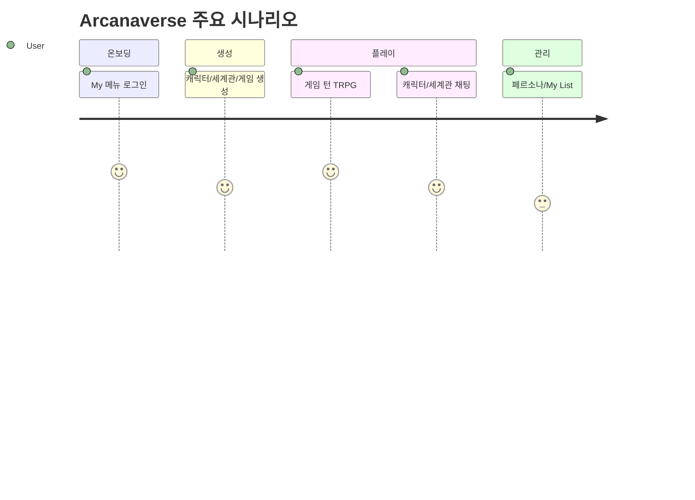

# 01. Project Overview

> **분석 기준:** 코드·설정 파일 (2026-06-14)  
> **프로젝트명:** Arcanaverse (TRPG AI / MVP)

---

## 1. 프로젝트 목적

AI를 게임 마스터(GM)처럼 활용하여 **세계관 생성 → 캐릭터 생성 → 게임 생성 → 턴 기반 TRPG 플레이**를 웹에서 제공하는 AI-Native TRPG 플랫폼이다.

- 저장소 README: `README.md`
- SSOT: `docs/SSOT.md`

---

## 2. 핵심 컨셉

| 컨셉 | 설명 | 코드 근거 |
|------|------|----------|
| AI GM | LLM이 상황·대사·스탯 변화(JSON) 생성 | `apps/llm/prompts/trpg_game_master.py`, `apps/api/routes/game_turn.py` |
| 티켓 기반 개발 | Markdown 티켓 → 구현 → 리포트 | `docs/tickets/`, `docs/AI_DEV_PROMPT.md` |
| 레이어드 아키텍처 | Route → Usecase → Adapter (신규 코드 목표) | `docs/ARCHITECTURE.md`, `src/`, `adapters/` |
| 정적 HTML 프론트 | 프로덕션 UI는 `apps/web-html/` | `docs/SSOT.md` |

---

## 3. 주요 기능 (요약)

| 영역 | 상태 | 비고 |
|------|------|------|
| Google 로그인 | 구현 | `apps/web-html/my.html`, `apps/api/routes/auth_google.py` |
| 캐릭터 CRUD·목록 | 구현 | `apps/api/routes/characters.py`, `home.html` |
| 세계관 CRUD | 구현 | `apps/api/routes/worlds.py` |
| 게임 생성·턴 플레이 | 구현 | `create/game.html`, `game_turn.py` |
| 캐릭터/세계관 채팅 (TRPG) | 구현 | `chat.html`, `world.html`, `app_chat.py` |
| 페르소나 관리 | 구현 | `personas.html`, `personas.py` |
| My List / My Create | 부분 구현 | `my_list.html`, `my_create.py` |
| Chat V2 API | 구현 | `chat_v2.py` (프론트 연결 여부는 확인 필요) |
| Stripe 결제 | **미구현** | README/SSOT에 planned만 명시 |
| Admin / Back Office | **미구현** | 전용 라우트·UI 없음 |

상세: `03_Feature_Index.md`

---

## 4. 기술 스택

| 계층 | 기술 |
|------|------|
| Backend | Python 3.12, FastAPI, Uvicorn |
| DB | MongoDB (기본), SQLite (레거시) |
| Vector DB | Qdrant |
| LLM | OpenAI (기본 `gpt-4o-mini` / `gpt-4.1-mini`), Ollama (선택·compose 비활성) |
| 스토리지 | Cloudflare R2 |
| 인증 | Google OAuth, JWT, `user_info_v2` 토큰 |
| Frontend (프로덕션) | 정적 HTML/JS (`apps/web-html/`) |
| Frontend (스캐폴드) | React TSX (`html/app/web/`) — 빌드·배포 미연결 |
| 컨테이너 | Docker Compose (`infra/`) |
| 리버스 프록시 | Nginx (Oracle VM) |
| 프론트 배포 | Cloudflare Pages (`arcanaverse.ai`) |
| CDN | `https://img.arcanaverse.ai` |

---

## 5. 실행 방법

### 5.1 Docker Compose (API + Qdrant)

```bash
docker network create app-net   # 최초 1회
cd infra
docker compose up -d --build
```

- API: `http://localhost:8000`
- Swagger: `http://localhost:8000/docs`
- Qdrant: `http://127.0.0.1:6333`

`infra/docker-compose.yml` 기준: **ollama, web 서비스는 주석 처리됨**.

### 5.2 API 네이티브 실행

```bash
pip install -r requirements.txt
# 환경변수 설정 (MONGO_URI, OPENAI_API_KEY, JWT_SECRET 등)
uvicorn apps.api.main:app --host 0.0.0.0 --port 8000 --reload
```

### 5.3 프론트엔드 로컬

`apps/web-html/`을 정적 서버로 서빙. `apps/web-html/js/config.js`가 로컬에서 `http://localhost:8000` API를 사용한다.

> `docs/QUICK_START.md`의 web(8080)·ollama 안내는 **현재 compose와 불일치**할 수 있음.

---

## 6. 환경 변수 (필수·주요)

출처: `apps/api/config.py`, `infra/docker-entrypoint.sh`, route 파일

| 변수 | 기본값 | 필수 | 설명 |
|------|--------|------|------|
| `MONGO_URI` | `""` | **예** (mongo 사용 시) | MongoDB 연결 |
| `MONGO_DB` / `MONGO_DB_NAME` | `arcanaverse` | 아니오 | DB 이름 |
| `OPENAI_API_KEY` | 없음 | LLM 사용 시 **예** | OpenAI |
| `OPENAI_MODEL` | `gpt-4.1-mini` | 아니오 | 기본 모델 |
| `JWT_SECRET` | `change-me-in-production` 등 | **예** (운영) | JWT 서명 |
| `GOOGLE_CLIENT_ID` | `""` | Google 로그인 시 **예** | OAuth |
| `AUTH_USER_INFO_V2_SECRET` | `arcanaverse.ai.secret.v2` | 권장 | user_info_v2 |
| `ASSET_BASE_URL` | `https://img.arcanaverse.ai` | 아니오 | CDN |
| `R2_*` | — | 이미지 업로드 시 | R2 자격증명 |
| `QDRANT_URL` | `http://localhost:6333` | RAG 사용 시 | Qdrant |
| `LLM_PROVIDER` | `openai` | 아니오 | `openai` / `ollama` |
| `PORT` | entrypoint `10000`, compose `8000` | 아니오 | API 포트 |

전체 목록: `02_Architecture.md`, `11_README_Draft.md`

---

## 7. 로컬 개발 워크플로

1. MongoDB 접속 가능한 `MONGO_URI` 설정
2. API 기동 (`uvicorn` 또는 Docker)
3. `apps/web-html` 정적 서빙 또는 Cloudflare Pages 연동
4. `my.html`에서 Google 로그인 (클라이언트 ID: `my.html` 내 하드코딩 — 운영 시 확인 필요)
5. 티켓 작업 시 `docs/AI_ENTRYPOINT.md` → `docs/SSOT.md` 순서로 문서 참조

---

## 8. 핵심 사용자 시나리오 (코드로 확인된 플로우)



| # | 시나리오 | 진입점 | 핵심 API |
|---|----------|--------|----------|
| 1 | Google 로그인 | `my.html` | `POST /v1/auth/google` |
| 2 | 캐릭터 탐색 | `home.html` | `GET /v1/characters` |
| 3 | 캐릭터 생성 | `create/character.html` | `POST /v1/characters` |
| 4 | 세계관 생성 | `create/world.html` | `POST /v1/worlds` |
| 5 | 게임 생성·플레이 | `create/game.html` → `game.html` | `POST /v1/games`, `POST /turn` |
| 6 | 캐릭터 채팅 | `chat.html` | `POST /v1/chat/` |
| 7 | 페르소나 관리 | `personas.html` | `/v1/users/me/personas` |

---

## 9. 주요 도메인

Character · World · Game · Chat · Persona · Auth · My List · Asset — 상세 `03_Feature_Index.md`  
NPC는 별도 엔티티 없이 `characters` + `game_session.characters_info`로 표현.

---

## 10. 현재 구현 범위

| 레이어 | 범위 |
|--------|------|
| Frontend | `apps/web-html/` 14 HTML 페이지 (프로덕션) |
| Backend | FastAPI 52 엔드포인트 (`main.py` 등록 기준) |
| DB | MongoDB ~18 컬렉션 |
| LLM | OpenAI (게임 턴 JSON + TRPG 채팅 + AI detail) |
| 미포함 | Stripe, Admin, Rules 실행 엔진, RAG(비활성) |

---

## 11. 배포·운영 URL (코드/설정 기준)

| 대상 | URL | 근거 |
|------|-----|------|
| 프론트 (운영) | `https://arcanaverse.ai` | `config.js`, CORS |
| API (운영) | `https://api.arcanaverse.ai` | `config.js`, nginx conf |
| CDN | `https://img.arcanaverse.ai` | `ASSET_BASE_URL` |
| API (로컬) | `http://localhost:8000` | `config.js`, compose |
| Swagger (로컬) | `http://localhost:8000/docs` | FastAPI |

---

## 12. MVP 관점 현재 상태

- **핵심 루프 동작:** 생성 → 게임 턴 → 채팅 (`15_MVP_Scope.md`)
- **공개 준비:** P0 보안·턴 안정성 해결 전 **데모/내부 한정** 권장
- **완성도 (주관적 코드 기준):** CRUD·채팅 ~80%, TRPG 엔진 ~55%, 운영 hardening ~40%

---

## 13. 오픈 전 남은 리스크 (요약)

P0: JWT/시크릿, debug API, 게임 턴 JSON/몬스터 스냅샷  
P1: Rules 저장↔실행 괴리, Favorite API, 테스트 부족  
상세: `09_Tech_Debt.md`, `15_MVP_Scope.md`

---

## 14. 관련 문서

| 문서 | 내용 |
|------|------|
| `02_Architecture.md` | 시스템 아키텍처 |
| `03_Feature_Index.md` | 기능 목록 |
| `13_TRPG_Engine.md` | TRPG 엔진 |
| `14_Code_Trace_Map.md` | 코드 추적표 |
| `15_MVP_Scope.md` | MVP 범위 |
| `analysis/00_Documentation_Index.md` | 전체 인덱스 |

---

## 분석 기준 파일

- `README.md`, `docs/SSOT.md`, `apps/api/main.py`, `apps/api/config.py`
- `infra/docker-compose.yml`, `apps/web-html/js/config.js`, `docs/QUICK_START.md`
