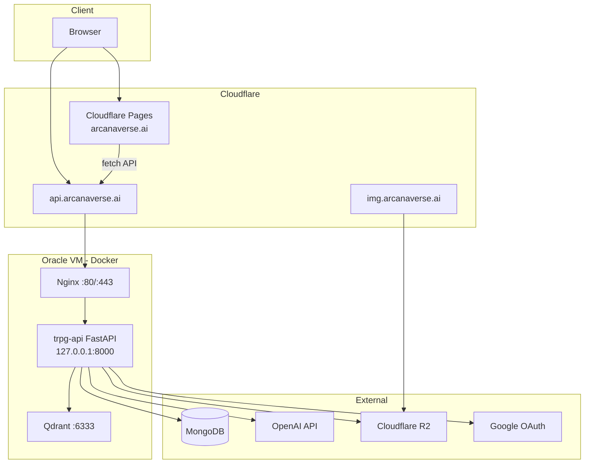
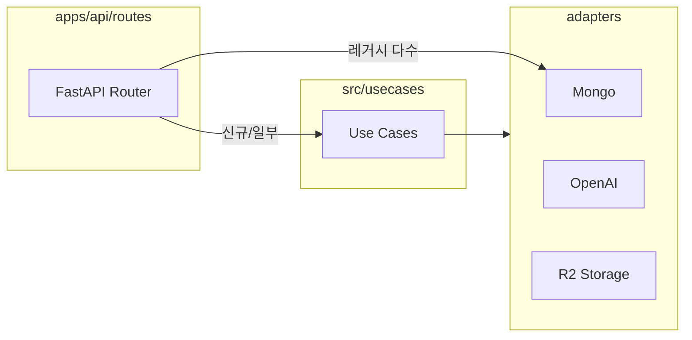
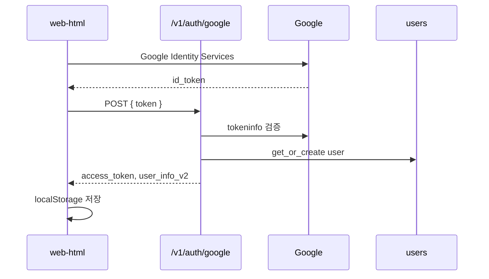
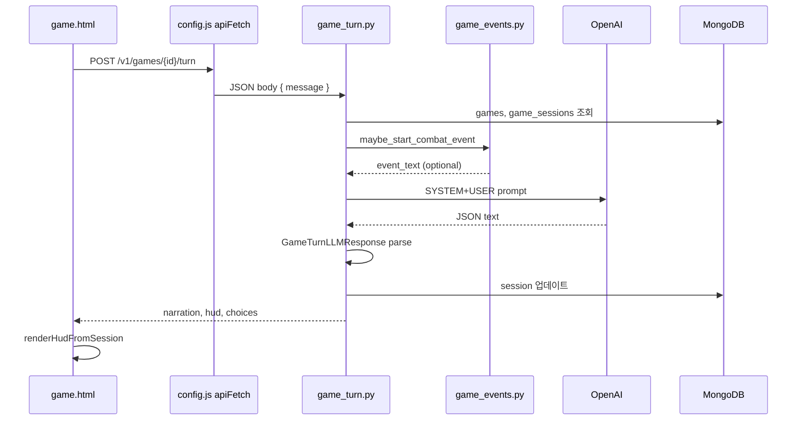
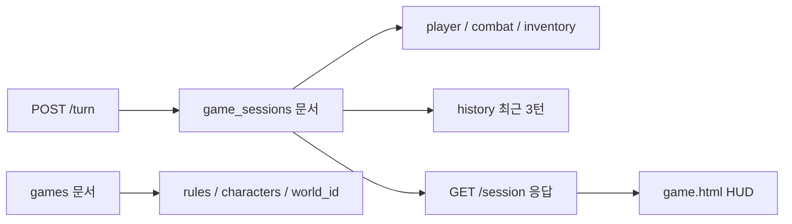

# 02. Architecture

> 코드·설정 기준 시스템 아키텍처 (2026-06-14)

---

## 1. 전체 구조

---

## 2. 레이어 구조 (백엔드)

목표 패턴: **API Route → Usecase → Adapter**

| 레이어 | 경로 | 역할 |
|--------|------|------|
| API | `apps/api/routes/` | HTTP 엔드포인트, 요청/응답 |
| Usecase | `src/usecases/` | 비즈니스 로직 (일부만 적용) |
| Domain | `src/domain/` | 도메인 엔티티 |
| Ports | `src/ports/` | 인터페이스 |
| Adapters | `adapters/` | MongoDB, OpenAI, R2, Embedding |

**현실:** 다수 route가 MongoDB에 **직접 접근** (레거시). `docs/architecture/ROUTES_DIRECT_MONGO_ACCESS.md` 참고.

---

## 3. Frontend

| 경로 | 용도 | 배포 |
|------|------|------|
| `apps/web-html/` | **프로덕션** 정적 HTML/JS | Cloudflare Pages |
| `html/app/web/` | React 스캐폴드 | **미배포** (`package.json` 없음) |

주요 페이지: `home.html`, `chat.html`, `world.html`, `game.html`, `create/*`, `my.html`, `my_list.html`, `personas.html`

API 베이스: `apps/web-html/js/config.js`

---

## 4. Backend (FastAPI)

- 엔트리: `apps/api/main.py`
- CORS: `ALLOWED_ORIGINS` 하드코딩 (로컬 + `arcanaverse.ai`)
- 미들웨어: Access log → `access_logs` 컬렉션
- 정적 마운트: `/assets/persona`, `/json`
- 등록 라우터: 52개 엔드포인트 (`04_API_Documentation.md`)

---

## 5. Database

| 백엔드 | 용도 | 설정 |
|--------|------|------|
| **MongoDB** | 기본 (`DB_BACKEND=mongo`) | `MONGO_URI`, `MONGO_DB` |
| SQLite | 레거시 | `DB_PATH`, `adapters/persistence/sqlite/` |

스키마: `05_Database_Schema.md`

---

## 6. Docker / Infra

| 파일 | 역할 |
|------|------|
| `infra/docker-compose.yml` | `api`, `qdrant` (ollama/web 주석) |
| `infra/docker-compose.reverse-proxy.yml` | Nginx 리버스 프록시 |
| `docker/api.Dockerfile` | API 이미지 |
| `infra/nginx/conf.d/api.arcanaverse.ai.conf` | SSL + 프록시 |
| `infra/docker-entrypoint.sh` | uvicorn 기동 |

네트워크: 외부 Docker network `app-net` (사전 생성 필요)

배포: `.github/workflows/deploy-dev.yml` → SSH → Oracle VM → `scripts/deploy_from_git.sh`

---

## 7. Nginx

- VM에서 80/443 수신 → `api:8000` 프록시
- Cloudflare Origin Certificate 사용 (`infra/README-reverse-proxy.md`)
- API는 `127.0.0.1:8000`만 바인딩, 외부 직접 노출 없음

---

## 8. 외부 연동

| 서비스 | 구현 | 관련 파일 |
|--------|------|----------|
| OpenAI | ✅ | `adapters/external/openai/`, `llm_client.py` |
| Ollama | △ 코드 있음, compose 비활성 | `adapters/external/llm_client.py`, `app_chat.py` |
| MongoDB | ✅ | `adapters/persistence/mongo/` |
| Cloudflare R2 | ✅ | `adapters/file_storage/r2_storage.py` |
| Qdrant | △ RAG 경로, 채팅에서 OFF | `app_chat.py` (`context=""`) |
| Google OAuth | ✅ | `auth_google.py` |
| Stripe | ❌ planned | README, SSOT만 |

---

## 9. LLM 호출 경로

| 경로 | 엔드포인트 | 출력 |
|------|-----------|------|
| 게임 턴 | `POST /v1/games/{id}/turn` | JSON (`GameTurnLLMResponse`) |
| TRPG 채팅 | `POST /v1/chat/` | 평문 + 선택지 |
| Chat V2 | `POST /chat/v2/.../messages` | 확인 필요 |
| 캐릭터/세계관 AI 생성 | `POST .../ai-detail` | JSON |

상세: `07_AI_Workflow.md`

---

## 10. 인증 흐름

후속 요청: `Authorization: Bearer {access_token}` 또는 `user_info_v2` + `validate-session`

---

## 11. API 호출 흐름 (게임 턴 — 코드 추적)

| 단계 | 파일 |
|------|------|
| Frontend Component | `apps/web-html/game.html` |
| API Client | `apps/web-html/js/config.js` (`apiFetch`) |
| Router | `apps/api/routes/game_turn.py` |
| Schema | `apps/api/schemas/game_turn.py` |
| Service | `apps/api/services/game_events.py` |
| Repository/DB | route 내 Mongo 직접 (`games`, `game_sessions`) |
| Prompt | `apps/llm/prompts/trpg_game_master.py` |

---

## 12. 게임 상태 저장 흐름

- **저장 컬렉션:** `game_sessions` (런타임 상태), `games` (메타·rules)
- **자동 저장:** 매 턴 `POST /turn` 시 MongoDB 업데이트
- **명시적 게임 종료 API:** 코드 기준 **미확인**

---

## 13. Frontend 구조 요약

| 경로 | 책임 |
|------|------|
| `apps/web-html/*.html` | 페이지 (프로덕션) |
| `apps/web-html/js/config.js` | `API_BASE`, `apiFetch`, `X-Anon-Id` |
| `apps/web-html/js/session.js` | 세션/토큰 (일부 페이지 `static/js/` 경로 불일치 **확인 필요**) |
| `html/app/web/` | React 소스 (프로덕션 미사용 가능성 — **확인 필요**) |

---

## 14. SSOT vs 코드 현실

| 항목 | SSOT 정책 | 코드 현실 |
|------|-----------|-----------|
| 레이어 | Route → Usecase → Adapter | 대부분 Route → Mongo 직접 |
| Chat | V2 목표 | V1 `/v1/chat/` + V2 API 병존 |
| Rules | 룰북 기반 플레이 | DB 저장만, LLM 미전달 |

정책 문서: `docs/SSOT.md`, `docs/architecture/ROUTES_DIRECT_MONGO_ACCESS.md`

---

## 분석 기준 파일

- `apps/api/main.py`, `docs/ARCHITECTURE.md`, `docs/SSOT.md`
- `infra/docker-compose.yml`, `infra/README-OPERATIONS.md`
- `adapters/`, `src/`, `apps/web-html/js/config.js`
