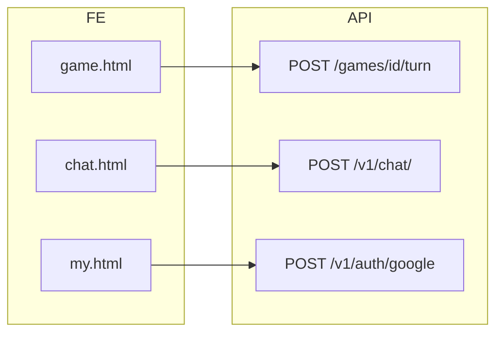

# 04. API Documentation

> `apps/api/main.py` 라우터 등록 기준 · **52개 엔드포인트** (2026-06-14)  
> Swagger: `http://localhost:8000/docs`

---

## 공통

| 항목 | 내용 |
|------|------|
| Base URL (로컬) | `http://localhost:8000` |
| Base URL (운영) | `https://api.arcanaverse.ai` |
| 인증 | `Authorization: Bearer {access_token}` 또는 `user_info_v2` + cookie |
| 에러 형식 | `{"detail": "..."}` (FastAPI 기본) |
| CORS | `apps/api/main.py` `ALLOWED_ORIGINS` |

---

## Root / Health

### API Root
- **Method:** GET
- **URL:** `/`
- **Description:** API 메타
- **Response:** `{"message": "TRPG AI API", "version": "1.0.0", "docs": "/docs"}`
- **Related Files:** `apps/api/main.py`

### Health Check
- **Method:** GET
- **URL:** `/health`
- **Description:** 헬스체크
- **Response:** `{"ok": true}`
- **Related Files:** `apps/api/main.py`

### Test OpenAI Chat
- **Method:** POST
- **URL:** `/api/test-openai-chat`
- **Description:** OpenAI 연동 테스트
- **Request Body:** `{"message": "string"}`
- **Response:** `{"reply": "..."}` 또는 `{"error": "...", "reply": ""}`
- **Related Files:** `apps/api/main.py`

---

## Health Router (`health.py`)

| Method | URL | Description | Auth |
|--------|-----|-------------|------|
| GET | `/health` | (router prefix 중복 가능) | 없음 |
| GET | `/health/env` | 환경변수 존재 여부 | 없음 |
| GET | `/health/db` | DB 연결 확인 | 없음 |
| POST | `/health/test-openai-chat` | OpenAI 테스트 | 없음 |

**Related Files:** `apps/api/routes/health.py`

---

## Auth (`/v1/auth`)

### Google Login
- **Method:** POST
- **URL:** `/v1/auth/google`
- **Description:** Google id_token 검증 → JWT + user_info_v2 발급
- **Request Body:** `{"token": "<google_id_token>"}`
- **Response:** `access_token`, `user_info_v2`, 사용자 정보
- **Error Cases:** 401 Invalid token
- **Related Files:** `apps/api/routes/auth_google.py`

### Validate Session
- **Method:** POST
- **URL:** `/v1/auth/validate-session`
- **Description:** user_info_v2 검증, is_use/is_lock 반환
- **Request Body:** `{"token": "<user_info_v2>"}`
- **Auth:** 내부 `get_current_user_from_token`
- **Related Files:** `apps/api/routes/auth.py`

### Get Me
- **Method:** GET
- **URL:** `/v1/auth/me`
- **Auth:** Bearer JWT
- **Related Files:** `apps/api/routes/auth.py`

### Logout
- **Method:** POST
- **URL:** `/v1/auth/logout`
- **Description:** 클라이언트 토큰 삭제 안내
- **Related Files:** `apps/api/routes/auth.py`

---

## Characters (`/v1/characters`)

### List Characters
- **Method:** GET
- **URL:** `/v1/characters`
- **Query:** `skip`, `limit`, `q` (검색)
- **Response:** 캐릭터 목록
- **Related Files:** `apps/api/routes/characters.py`

### Get Character
- **Method:** GET
- **URL:** `/v1/characters/{character_id}`
- **Description:** `6` 또는 `char_06` 형식 허용
- **Related Files:** `characters.py`

### Create Character
- **Method:** POST
- **URL:** `/v1/characters`
- **Auth:** Required
- **Request:** multipart `file` + `meta` JSON
- **Related Files:** `characters.py`, `src/domain/character.py`

### My Characters
- **Method:** GET
- **URL:** `/v1/characters/my`
- **Auth:** Required
- **Related Files:** `characters.py`

### AI Detail / Upload Image / Count / Bootstrap
| Method | URL | Auth |
|--------|-----|------|
| POST | `/v1/characters/ai-detail` | 없음 |
| POST | `/v1/characters/upload-image` | 없음 |
| GET | `/v1/characters/count` | 없음 |
| GET | `/v1/characters/{id}/chat/bootstrap` | Required |

**Related Files:** `characters.py`, `apps/api/schemas/` (인라인 모델)

---

## Worlds (`/v1/worlds`)

| Method | URL | Auth | Description |
|--------|-----|------|-------------|
| GET | `/v1/worlds` | 없음 | 목록 |
| GET | `/v1/worlds/{world_id}` | 없음 | 상세 |
| POST | `/v1/worlds` | Required | 생성 |
| POST | `/v1/worlds/upload-image` | 없음 | 이미지 |
| POST | `/v1/worlds/ai-detail` | 없음 | AI 생성 |
| GET | `/v1/worlds/{world_id}/chat/bootstrap` | Required | 채팅 재개 |

**Related Files:** `apps/api/routes/worlds.py`

---

## Games (`/v1/games`)

### Create Game
- **Method:** POST
- **URL:** `/v1/games`
- **Auth:** Required
- **Request:** multipart `meta` (GameCreateRequest) + optional `file`
- **Schema:** `apps/api/models/games.py`
- **Related Files:** `apps/api/routes/games.py`

### Play Turn
- **Method:** POST
- **URL:** `/v1/games/{game_id}/turn`
- **Auth:** Required
- **Request Body:** `{"user_message": "string"}`
- **Response:** `GameTurnResponse` (`apps/api/schemas/game_turn.py`)
- **Related Files:** `apps/api/routes/game_turn.py`, `apps/llm/prompts/trpg_game_master.py`

### Session / Persona / List / Detail
| Method | URL | Auth |
|--------|-----|------|
| GET | `/v1/games` | 없음 |
| GET | `/v1/games/{game_id}` | 없음 |
| GET | `/v1/games/{game_id}/session` | Required |
| POST | `/v1/games/{game_id}/persona` | Required |
| GET | `/v1/games/health` | 없음 |

---

## Chat (`/v1/chat`)

### TRPG/QA Chat
- **Method:** POST
- **URL:** `/v1/chat/`
- **Auth:** Required
- **Request Body:** `message`, `mode` (`trpg`|`qa`), `character`, `choices`, `game_id`, `world_id`, `chat_type` 등
- **Response:** `{"trace_id", "answer", "sid"}`
- **Related Files:** `apps/api/routes/app_chat.py`, `services/chat_persist.py`

### Reset / Health
| Method | URL |
|--------|-----|
| POST | `/v1/chat/reset` |
| GET | `/v1/chat/health` |

---

## Chat V2 (`/chat/v2`)

### Open Chat
- **Method:** GET
- **URL:** `/chat/v2/{chat_type}/{entity_id}`
- **Auth:** Required
- **Related Files:** `chat_v2.py`, `src/usecases/chat/open_chat.py`

### Send Message
- **Method:** POST
- **URL:** `/chat/v2/{chat_type}/{entity_id}/messages`
- **Auth:** Required
- **Schema:** `apps/api/schemas/chat_v2.py`
- **Related Files:** `chat_v2.py`, `adapters/persistence/mongo/chat_repository_adapter.py`

---

## Personas (`/v1`)

| Method | URL | Auth |
|--------|-----|------|
| GET | `/v1/personas/presets` | 없음 |
| GET | `/v1/users/me/personas` | Required |
| POST | `/v1/users/me/personas` | Required |
| PUT | `/v1/users/me/personas/{persona_id}` | Required |
| DELETE | `/v1/users/me/personas/{persona_id}` | Required |
| PATCH | `/v1/users/me/personas/{persona_id}/default` | Required |
| POST | `/v1/uploads/persona-image` | Required |

**Related Files:** `apps/api/routes/personas.py`

---

## Sessions

| Method | URL | Description |
|--------|-----|-------------|
| POST | `/v1/character-sessions/{session_id}/persona` | 캐릭터 세션 페르소나 |
| POST | `/v1/world-sessions/{session_id}/persona` | 세계관 세션 페르소나 |

**Related Files:** `character_sessions.py`, `world_sessions.py`

---

## My Create (`/api`)

| Method | URL | Auth | Description |
|--------|-----|------|-------------|
| GET | `/api/my/characters` | Required | My List용 |
| GET | `/api/my-create/characters` | Required | My Create용 |

**Related Files:** `apps/api/routes/my_create.py`

---

## Users (`/v1/users`)

| Method | URL | Description |
|--------|-----|-------------|
| POST | `/v1/users` | 사용자 생성 |
| GET | `/v1/users/{user_id}` | 조회 |
| PATCH | `/v1/users/{user_id}` | 수정 |
| DELETE | `/v1/users/{user_id}` | 삭제 |

**Schema:** `apps/api/schemas/user.py`  
**Related Files:** `apps/api/routes/user.py`

---

## Logs (`/v1/logs`)

| Method | URL | Description |
|--------|-----|-------------|
| POST | `/v1/logs/event` | 클라이언트 이벤트 |
| POST | `/v1/logs/error` | 클라이언트 에러 |

**Related Files:** `apps/api/routes/logs.py`, `services/logging_service.py`

---

## Assets

### List Images
- **Method:** GET
- **URL:** `/assets/images`
- **Query:** `prefix`
- **Related Files:** `apps/api/routes/assets.py`

---

## Ask (`/v1/ask`)

| Method | URL |
|--------|-----|
| GET | `/v1/ask?q=` |
| GET | `/v1/ask/health` |

**Related Files:** `apps/api/routes/ask.py`, `src/usecases/rag/answer_question.py`

---

## Debug / Ops

| Method | URL | Description |
|--------|-----|-------------|
| GET | `/v1/debug/mongo-ping` | Mongo ping |
| GET | `/_debug/db` | DB 디버그 |
| POST | `/_ops/migrate/sqlite-to-mongo` | 마이그레이션 |

---

## 미등록 라우터 (main.py에 없음)

| 파일 | 비고 |
|------|------|
| `apps/api/routes/app_api.py` | `ask.py` 중복 |
| `apps/api/routes/chat.py` | 테스트용, `app_chat.py`가 대체 |
| `apps/api/routes/ask_chat.py` | CLI 스크립트, API 아님 |

---

## Service Layer 매핑 (일부)

| API | Usecase | Adapter |
|-----|---------|---------|
| Chat V2 | `src/usecases/chat/open_chat.py`, `send_message.py` | `chat_repository_adapter.py` |
| Characters list/get | `src/usecases/character/` | `character_repository_adapter.py` |
| Game turn | — (route 직접) | Mongo 직접, `llm_client` |
| `/v1/chat/` | — | Mongo 직접, OpenAI |

---

## 핵심 API 상세 (코드 추적 형식)

### 게임 턴 (Play Turn)

- **Method:** POST
- **URL:** `/v1/games/{game_id}/turn`
- **Purpose:** 플레이어 입력 처리 → LLM JSON GM 응답 → 세션·HUD 갱신
- **Auth Required:** Yes (`get_current_user`)
- **Request Params:** `game_id` (path)
- **Request Body:** `{ "user_message": "string" }` (`GameTurnRequest`)
- **Response:** `GameTurnResponse` — `narration`, `dialogues`, `choices`, `session`, `status_changes`
- **Error Cases:** 404 game/session, 401, LLM 실패 시 narration-only fallback
- **Router File:** `apps/api/routes/game_turn.py` (`play_turn`)
- **Schema File:** `apps/api/schemas/game_turn.py`
- **Service File:** `apps/api/services/game_events.py` (랜덤 전투)
- **DB Collection:** `games`, `game_sessions`
- **Frontend Caller:** `apps/web-html/game.html` (`askLLM` → `apiFetch`)
- **구현 상태:** `[x]` 구현
- **확인 필요 사항:** `items_add` 미적용, `rules` 미전달, 몬스터 스냅샷 TODO

**사용 흐름:** `create/game.html` → `POST /games` → `game.html` → `GET /session` → loop `POST /turn`

---

### 게임 생성 (Create Game)

- **Method:** POST
- **URL:** `/v1/games`
- **Purpose:** 세계관·캐릭터·룰 기반 게임 메타 생성
- **Auth Required:** Yes
- **Request Body:** `GameCreateRequest` (multipart: meta JSON + optional background image)
- **Response:** `{ "id": int, ... }`
- **Router File:** `apps/api/routes/games.py`
- **Schema File:** `apps/api/models/games.py`, request models in route
- **Service File:** route 직접 (R2 업로드 inline)
- **DB Collection:** `games` (+ 초기 `game_sessions`는 GET session 시)
- **Frontend Caller:** `apps/web-html/create/game.html`
- **구현 상태:** `[x]` 구현

---

### TRPG 채팅 (Legacy Chat)

- **Method:** POST
- **URL:** `/v1/chat/`
- **Purpose:** 캐릭터/세계관 평문 TRPG 또는 QA 대화
- **Auth Required:** Optional (세션 persist 시 필요)
- **Request Body:** `{ "mode", "entity_type", "entity_id", "message", "session_id?", ... }`
- **Response:** `{ "reply", "choices?", "session_id" }`
- **Router File:** `apps/api/routes/app_chat.py`
- **Schema File:** route 내 inline / dict
- **Service File:** `apps/api/services/chat_persist.py`
- **DB Collection:** `character_sessions`, `world_sessions`
- **Frontend Caller:** `chat.html`, `world.html`
- **구현 상태:** `[x]` 구현
- **확인 필요 사항:** RAG `context=""` 고정 OFF

---

### Google 로그인

- **Method:** POST
- **URL:** `/v1/auth/google`
- **Purpose:** Google id_token 검증 → JWT + user_info_v2
- **Auth Required:** No
- **Request Body:** `{ "token": "<google_id_token>" }`
- **Response:** `access_token`, `user_info_v2`, user profile
- **Router File:** `apps/api/routes/auth_google.py`
- **Schema File:** route 내 Pydantic models
- **Service File:** —
- **DB Collection:** `users`
- **Frontend Caller:** `apps/web-html/my.html`
- **구현 상태:** `[x]` 구현

---

### API 호출 흐름 요약

---

## 분석 기준 파일

- `apps/api/main.py`, `apps/api/routes/*.py`
- `apps/api/schemas/`, `apps/api/models/games.py`
