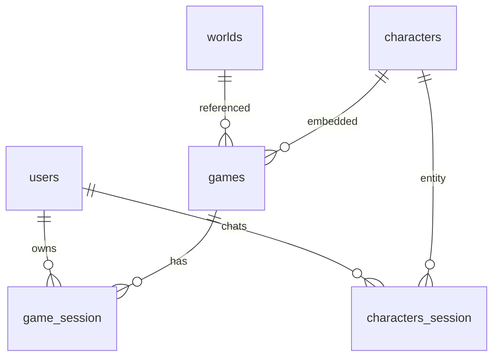

# 05. Database Schema

> MongoDB 기본 (`MONGO_DB=arcanaverse`) · 코드 기준 (2026-06-14)

---

## 개요

| 항목 | 내용 |
|------|------|
| 연결 | `adapters/persistence/mongo/__init__.py` (`get_db()`) |
| 인덱스 초기화 | `apps/api/startup.py` → `init_mongo_indexes()` |
| ID 발급 | 대부분 `max(id)+1` (routes); `sequences` 컬렉션 유틸은 있으나 제한적 사용 |

---

## 1. `characters`

| 항목 | 내용 |
|------|------|
| **용도** | TRPG 캐릭터 메타데이터 |
| **주요 필드** | `id` (int, PK), `name`, `summary`, `detail`, `tags`, `archetype`, `image`/`image_path`, `creator`, `reg_user`, `system_prompt`, `gender`, `status`, `created_at`, `updated_at` |
| **필수** | `id`, `name` (생성 시) |
| **관계** | `games.characters[].char_ref_id`, `users` (creator) |
| **인덱스** | `id` unique (`startup`); `image` unique (`init_db`만) |
| **관련 API** | `/v1/characters/*`, `/api/my-create/characters` |
| **관련 파일** | `characters.py`, `src/domain/character.py`, `character_repository_adapter.py` |

---

## 2. `worlds`

| 항목 | 내용 |
|------|------|
| **용도** | 세계관 정의 |
| **주요 필드** | `id`, `name`, `genre`, `summary`, `detail`, `tags`, `image`, `regions`, `factions`, `opening_scene`, `reg_user`, `created_at`, `updated_at` |
| **인덱스** | **없음** (코드 기준) |
| **관련 API** | `/v1/worlds/*` |
| **관련 파일** | `apps/api/routes/worlds.py` |

---

## 3. `games`

| 항목 | 내용 |
|------|------|
| **용도** | 게임 시나리오·규칙 템플릿 |
| **주요 필드** | `id`, `title`, `world_ref_id`, `world_snapshot`, `scenario_summary`, `scenario_detail`, `characters[]`, `rules`, `background_image_path`, `reg_user`, `status`, `created_at`, `updated_at` |
| **rules 구조** | `success_base`, `difficulty_mod`, `attributes`, `dice`, `damage`, `critical`, `events` |
| **인덱스** | `id` unique, `reg_user`, `world_ref_id`, `status` |
| **관련 API** | `/v1/games/*` |
| **관련 파일** | `games.py`, `apps/api/models/games.py` |

---

## 4. `game_session`

| 항목 | 내용 |
|------|------|
| **용도** | 플레이어별 런타임 게임 상태 |
| **주요 필드** | `game_id`, `owner_ref_info.user_ref_id`, `turn`, `user_info` (hp/mp/items), `characters_info[]`, `combat` (`in_combat`, `monsters`, `phase`), `story_history[]`, `persona_ref_id`, `player_persona`, `world_snapshot` |
| **필수** | `game_id`, `owner_ref_info` (조회 시) |
| **관계** | `games` (game_id), `users` (owner) |
| **인덱스** | `(game_id, owner_ref_info.user_ref_id)` |
| **관련 API** | `GET /v1/games/{id}/session`, `POST /v1/games/{id}/turn` |
| **관련 파일** | `games.py`, `game_turn.py`, `schemas/game_turn.py` |

### `game_sessions` 주요 필드 상세

| 필드명 | 타입 | 필수 | 설명 | 예시 | 확인 상태 |
|--------|------|------|------|------|----------|
| `game_id` | int | Y | `games.id` FK | `42` | 확인됨 |
| `owner_ref_info.user_ref_id` | int | Y | 소유 사용자 | `7` | 확인됨 |
| `turn` | int | Y | 현재 턴 수 | `3` | 확인됨 |
| `player` | object | Y | HP/MP/Gold 등 | `{hp:80,mp:50,gold:100}` | 확인됨 |
| `characters_info` | array | N | NPC 스냅샷 | `[{snapshot,...}]` | 확인됨 |
| `combat.in_combat` | bool | N | 전투 중 여부 | `true` | 확인됨 |
| `combat.monsters` | array | N | 몬스터 상태 | `[{name,hp}]` | 확인됨 |
| `combat.phase` | string | N | phase 저장 | `"combat"` | 로직 미연결 |
| `story_history` | array | N | 최근 서사 | `[{role,content}]` | 확인됨 |
| `turn_logs` | array | N | 턴별 로그 | narration/dialogue | 확인됨 |
| `persona_ref_id` | int | N | 페르소나 참조 | `1` | 확인됨 |
| `world_snapshot` | object | N | 세계관 스냅샷 | `{name,genre}` | 확인됨 |

- **인덱스:** `(game_id, owner_ref_info.user_ref_id)` — `startup.py`
- **생성/수정:** `GET /session` 시 upsert, `POST /turn` 시 매 턴 update
- **정합성 리스크:** LLM `updated_combat` 무검증 적용, `items_add` 미반영
- **확인 필요:** `inventory` 필드 FE 표시 범위

---

## 5. `game_status` (DEPRECATED)

| 항목 | 내용 |
|------|------|
| **용도** | 구 게임 상태 (`game_session`으로 대체) |
| **관련 파일** | `apps/api/services/game_status_service.py` |

---

## 6. `users`

| 항목 | 내용 |
|------|------|
| **용도** | 사용자 계정 + **임베디드 `personas[]`** |
| **주요 필드** | `_id`, `email`, `google_id`, `display_name`, `is_use`, `is_lock`, `member_level`, `personas[]` (`persona_id`, `name`, `gender`, `bio`, `image_key`, `is_default`) |
| **인덱스** | **없음** |
| **관련 API** | `/v1/auth/*`, `/v1/users/me/personas` |
| **관련 파일** | `auth_google.py`, `personas.py`, `schemas/user.py` |

---

## 7. 채팅 V2: `chat_session`, `chat_message`, `chat_event`

| 컬렉션 | 용도 | 키 |
|--------|------|-----|
| `chat_session` | V2 세션 | `(user_id, chat_type, entity_id)` unique |
| `chat_message` | 메시지 | `session_id`, `role`, `content` |
| `chat_event` | 이벤트 | `session_id`, `event_type`, `payload` |

**인덱스:** `chat_repository_adapter.py`, `startup.py`  
**관련 API:** `/chat/v2/*`  
**Schema:** `apps/api/schemas/chat_v2.py`

---

## 8. 레거시 채팅: `characters_session`, `characters_message`, `characters_event`

| 항목 | 내용 |
|------|------|
| **용도** | `/v1/chat/` 캐릭터 채팅 persist |
| **키** | `user_id`, `chat_type: "character"`, `entity_id` |
| **추가** | `persona` 스냅샷, `last_message_at` |
| **인덱스** | **없음** |
| **관련 파일** | `services/chat_persist.py`, `app_chat.py` |

---

## 9. 월드 채팅: `worlds_session`, `worlds_message`, `worlds_event`

| 항목 | 내용 |
|------|------|
| **용도** | 세계관 채팅 |
| **인덱스** | `startup.ensure_world_chat_indexes()` — session unique composite 등 |
| **관련 파일** | `chat_persist.py`, `worlds.py` |

---

## 10. 로그: `access_logs`, `event_logs`, `error_logs`

| 컬렉션 | 용도 | 인덱스 |
|--------|------|--------|
| `access_logs` | HTTP access | `ts`, `anon_id`, `user_id` |
| `event_logs` | 이벤트 | `name+ts`, `anon_id`, `user_id` |
| `error_logs` | 에러 | `kind+ts` |

**관련 파일:** `logging_service.py`, `main.py` middleware

---

## 11. 기타

| 컬렉션 | 용도 | 비고 |
|--------|------|------|
| `sequences` | auto-increment | 실제 ID는 max+1 패턴 주류 |
| `images` | R2 메타 | `MONGO_IMAGES_COLLECTION` env |

---

## ER 개요

---

## SQLite (레거시)

| 항목 | 내용 |
|------|------|
| 경로 | `DB_PATH` (`/data/db/app.sqlite3`) |
| 사용 | `DB_BACKEND=sqlite` 시 |
| 관련 | `adapters/persistence/sqlite/` |

---

## 분석 기준 파일

- `apps/api/startup.py`, `adapters/persistence/mongo/`
- `apps/api/routes/games.py`, `game_turn.py`, `chat_persist.py`
- `apps/api/models/games.py`, `apps/api/schemas/`
