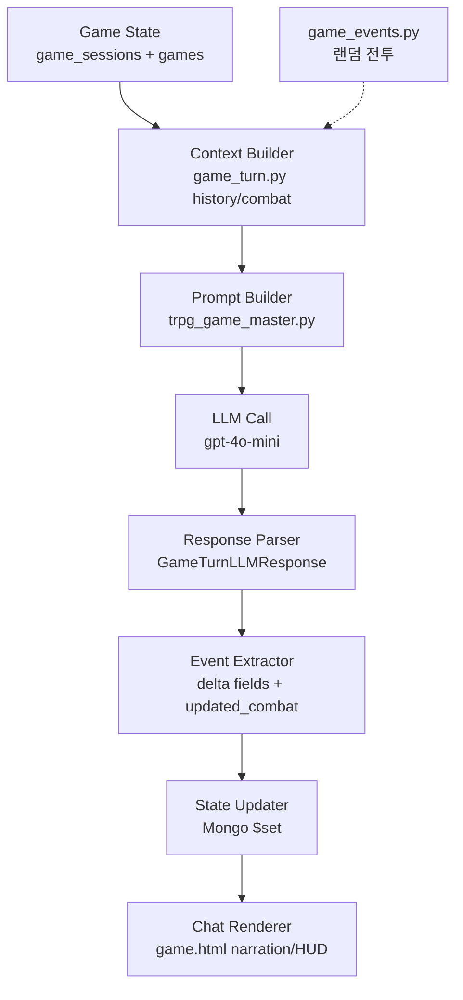

# 07. AI Workflow

> LLM/AI 관련 코드 분석 (2026-06-14)  
> 상세 분석: `docs/analysis/trpg-llm-*.md`

---

## 1. 요약

LLM 코드는 **존재함**. 주요 경로 3개:

| 경로 | 용도 | 모델 (코드 기준) |
|------|------|-----------------|
| 게임 턴 | 구조화 JSON GM | `gpt-4o-mini` (`game_turn.py`) |
| TRPG/QA 채팅 | 평문 장면 | `gpt-4o-mini` (`app_chat.py`) |
| AI 메타 생성 | 캐릭터/세계관 detail | OpenAI (`characters.py`, `worlds.py`) |

Provider 팩토리: `adapters/external/llm_client.py` (`LLM_PROVIDER=openai|ollama`)

---

## 2. LLM 호출 위치

| 파일 | 함수/엔드포인트 | 설명 |
|------|----------------|------|
| `apps/api/routes/game_turn.py` | `play_turn` | 게임 턴 JSON |
| `apps/api/routes/app_chat.py` | `chat` | TRPG/QA 평문 |
| `apps/api/routes/chat_v2.py` | `send_message` | V2 채팅 |
| `apps/api/routes/characters.py` | `ai_generate_character_detail` | 캐릭터 AI 생성 |
| `apps/api/routes/worlds.py` | `ai_generate_world_detail` | 세계관 AI 생성 |
| `apps/api/main.py` | `test_openai_chat` | 테스트 |
| `adapters/external/openai/openai_client.py` | `generate_chat_completion` | OpenAI 래퍼 |

---

## 3. Prompt 구성

### 3.1 게임 턴 (구조화)

**System:** `SYSTEM_PROMPT_TRPG` (`apps/llm/prompts/trpg_game_master.py`)
- JSON 스키마: `narration`, `dialogues`, `status_changes`, `updated_combat`

**User:** 동적 조립 (`game_turn.py` + `build_trpg_user_prompt`)
1. `[랜덤 이벤트]` (조건부)
2. `[현재 세션 상태]` HP/전투 요약
3. 세계관 summary, 캐릭터 summary, history 3개, 플레이어 입력

**Messages:** `[system, user]` 2개만 (multi-turn history 없음)

### 3.2 TRPG 채팅 (평문)

**System:** `SYS_TRPG` / `SYS_TRPG_NOCHOICE` (`app_chat.py`)
- 장면 문체, 선택지 형식

**추가:** 캐릭터 프로필, persona, gender, char_rules

**History:** `MAX_TURNS_TRPG=3` → 최근 6 메시지

### 3.3 후처리

| 함수 | 역할 |
|------|------|
| `postprocess_trpg()` | `[선택지]` 추출, 문장 정제 |
| `polish()` | 2차 LLM 폴리싱 (`ENABLE_POLISH=0` 기본 OFF) |
| `extract_json()` | 게임 턴 JSON 추출 |

---

## 4. Context 생성

| 경로 | 컨텍스트 소스 |
|------|--------------|
| 게임 턴 | `world_snapshot`, `story_history[-3:]`, session HP |
| TRPG 채팅 | 인메모리 `SESSIONS`, 캐릭터 dict, persona |
| RAG | **비활성** — `context=""` (`app_chat.py`) |

**미사용:** `engine_input` dict (`game_turn.py`) — LLM에 전달 안 됨

상세: `docs/analysis/trpg-llm-context-engineering-analysis.md`

---

## 5. Game State 관리

| 항목 | 구현 |
|------|------|
| 저장소 | MongoDB `game_session` |
| 스냅샷 | `GameSessionSnapshot` (`schemas/game_turn.py`) |
| 턴 증가 | `session.turn += 1` 또는 이벤트 시 선증가 |
| 스탯 반영 | `status_changes` delta → player/npc HP/MP/gold |
| 전투 상태 | `updated_combat` LLM trust + `game_events` 서버 시작 |
| FSM | **없음** (`phase` 저장만) |

상세: `docs/analysis/trpg-state-machine-agent-workflow-analysis.md`

---

## 6. Memory

| 유형 | 구현 |
|------|------|
| 게임 턴 | `story_history` / `turn_logs` in MongoDB |
| TRPG 채팅 | 인메모리 `SESSIONS` (쿠키 sid, TTL) |
| Chat V2 | `chat_message` 컬렉션 |
| RAG 장기 메모리 | Qdrant (`my_docs`) — 채팅에서 OFF |

---

## 7. Retry / Error Handling

| 항목 | 구현 |
|------|------|
| LLM 타임아웃 | `app_chat.py` `_invoke_llm_with_timeout` 25s |
| JSON 파싱 실패 | 3단계 폴백 (`extract_json` → `build_fallback_llm_response`) |
| LLM 재시도 | **명시적 retry 없음** |
| 실패 로깅 | `event_logs` (`chat_response_fail`) |
| HTTP 500 | exception handler → `error_logs` |

---

## 8. Token 관리

| 항목 | 상태 |
|------|------|
| 입력 토큰 예산 | **미구현** |
| `max_tokens` | 게임 턴 1024, 채팅 설정값 |
| 히스토리 truncation | TRPG 3턴, 게임 history 3 엔트리 |
| 비용 추적 | **미구현** |

---

## 9. Validation

| 항목 | 방식 |
|------|------|
| 게임 턴 출력 | `GameTurnLLMResponse` Pydantic |
| 파싱 실패 | narration-only fallback, delta=0 |
| 서사 vs 스탯 교차검증 | **없음** |
| `updated_combat` | 검증 없이 적용 |

---

## 10. 랜덤 이벤트 (비-LLM)

`apps/api/services/game_events.py`
- 매 턴 `rules.events` 확률로 전투 시작
- 서버가 `combat.in_combat=true` 설정 후 LLM에 이벤트 텍스트 전달

---

## 11. AI 파이프라인 (게임 턴 — 코드 기준)

| 단계 | 구현 | 파일 |
|------|------|------|
| Game State | ✅ | `game_sessions`, `games` |
| Context Builder | ✅ 부분 | `game_turn.py` (history 3, combat) |
| Prompt Builder | ✅ | `trpg_game_master.py` |
| LLM Call | ✅ | `openai_client.py` |
| Response Parser | ✅ | Pydantic + fallback |
| Event Extractor | ✅ 부분 | HP/MP/gold delta, `updated_combat` |
| State Updater | ✅ | route 내 Mongo update |
| Chat Renderer | ✅ | `game.html` |
| Memory (장기) | ❌ | 현재 코드 기준 확인되지 않음 |
| Retry (LLM) | ❌ | 현재 코드 기준 확인되지 않음 |

---

## 12. Hallucination 방지 / 리스크

| 구조 | 상태 |
|------|------|
| JSON 스키마 강제 | Pydantic 파싱 |
| 서사-수치 교차검증 | **없음** |
| combat 종료 서버 판정 | **없음** (LLM `updated_combat` 신뢰) |
| rules 주입 | **없음** (저장만) |
| `engine_input` | **dead code** (LLM 미전달) |

---

## 13. 미구현 / 확인 필요

| 항목 | 상태 |
|------|------|
| 토큰 예산·비용 추적 | 미구현 |
| LLM Retry | 미구현 |
| Chat V2 프론트 연결 | 확인 필요 |
| RAG (Qdrant) | 비활성 (`context=""`) |
| `items_add`, `exp` delta | 스키마만 / 미적용 |

---

## 분석 기준 파일

- `apps/llm/prompts/trpg_game_master.py`
- `apps/api/routes/game_turn.py`, `app_chat.py`, `chat_v2.py`
- `adapters/external/llm_client.py`, `openai/openai_client.py`
- `apps/api/services/game_events.py`
- `docs/analysis/trpg-llm-narrative-event-separation-analysis.md`
- `docs/analysis/trpg-llm-context-engineering-analysis.md`
- `docs/analysis/trpg-state-machine-agent-workflow-analysis.md`
