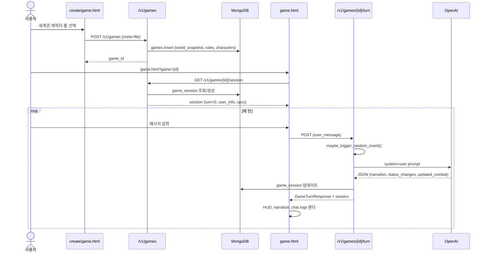
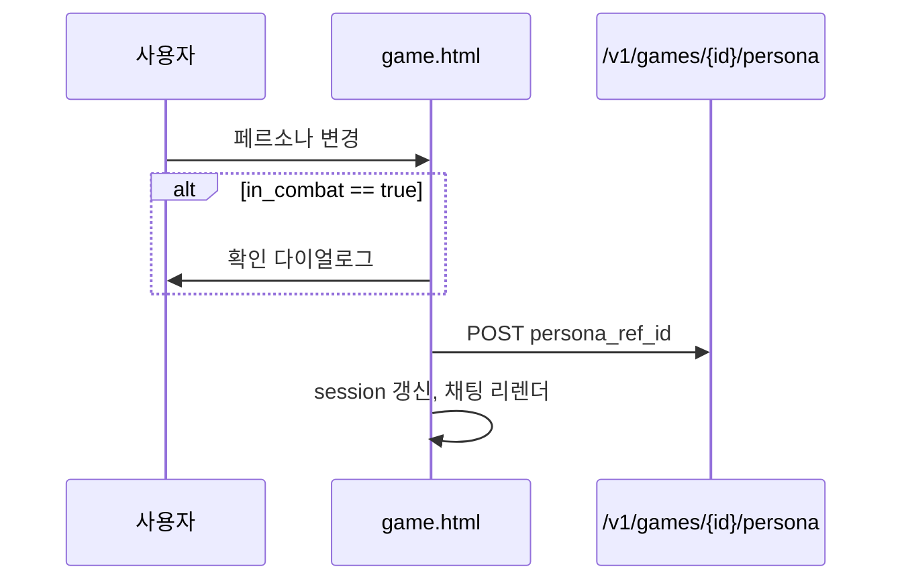

# 08. Game Flow

> 게임 생성 → 플레이 흐름 (코드 기준, 2026-06-14)

---

## 1. 전체 시퀀스

---

## 2. 단계별 상세

### 2.1 캐릭터 선택

| 항목 | 내용 |
|------|------|
| UI | `apps/web-html/create/game.html` |
| 데이터 | `selectedCharacters[]` → `{ char_ref_id, role }` |
| API | `POST /v1/games` body `characters` |
| 서버 | `characters` 컬렉션 조회 → `characters_info[].snapshot` 생성 |
| NPC vs PC | 동일 `characters` 엔티티; role 필드 (`random` 등) |

### 2.2 세계관 선택

| 항목 | 내용 |
|------|------|
| UI | `create/game.html` 세계관 카드 선택 |
| API | `world_ref_id` in GameCreateRequest |
| 서버 | `worlds` 조회 → `world_snapshot` 스냅샷 저장 (`games.world_snapshot`) |

### 2.3 룰 설정

| 항목 | 내용 |
|------|------|
| UI | `create/game.html` rules 폼 (dice, damage, critical, attributes) |
| 저장 | `games.rules` |
| LLM 전달 | **미구현** (턴 API 프롬프트에 rules 미포함) |
| 서버 사용 | `rules.events` → `game_events.py` 확률만 |

### 2.4 게임 생성

| 항목 | 내용 |
|------|------|
| API | `POST /v1/games` (`apps/api/routes/games.py`) |
| Auth | Required |
| 결과 | `games` 문서 + `id` 반환 |

### 2.5 세션 시작

| 항목 | 내용 |
|------|------|
| API | `GET /v1/games/{game_id}/session` |
| 생성 시 | `turn=0`, `combat.in_combat=false`, `story_history=[]` |
| user_info | `rules.attributes` 기반 HP/MP 초기화 |
| 페르소나 | 기본 페르소나 자동 적용 (`get_default_persona`) |

### 2.6 채팅 / 턴 플레이

| 항목 | 내용 |
|------|------|
| UI | `game.html` — `askLLM()` → `/v1/games/{id}/turn` |
| 입력 | `user_message` |
| 출력 | `narration`, `dialogues`, `session.turn_logs` |
| 렌더 | `renderHudFromSession`, `renderChatLogsFromSession` |

**참고:** 캐릭터/세계관 **일반 채팅**은 `chat.html`/`world.html` → `POST /v1/chat/` (게임 턴 API와 별도)

### 2.7 HUD / 상태값

| 표시 | 소스 |
|------|------|
| HP/MP/Gold | `session.player` |
| NPC HP/MP | `session.npcs` |
| 내레이션 | `turn_logs` 중 `speaker_type=narration` |
| 턴 수 | `session.turn` → 시나리오 제목 갱신 |

**미표시:** 몬스터 HUD, 인벤토리 상세, 경험치

### 2.8 게임 종료 / 저장

| 항목 | 상태 |
|------|------|
| 자동 저장 | ✅ 매 턴 `game_session` MongoDB upsert |
| 명시적 종료 UI | ❌ 미구현 |
| 재개 | ✅ `GET /session` + `game.html` 재진입 |

---

## 3. 페르소나 적용 (게임 중)

**관련:** `game.html` L1377, `POST /v1/games/{game_id}/persona`

---

## 4. 랜덤 전투 이벤트 (턴 내)

1. `maybe_trigger_random_event()` — `rules.events.base_chance` + 주사위
2. 성공 시 `apply_event_to_session()` — `in_combat=true`, `story_history`에 내레이션
3. LLM 프롬프트에 `[랜덤 이벤트 발생]` 추가
4. LLM이 전투 서사·`updated_combat` 반환

---

## 5. Create 플로우 vs Play 플로우

| 단계 | Create | Play |
|------|--------|------|
| 진입 | `/create/index.html` | `/game.html?game={id}` |
| 선행 | 로그인 권장 | 로그인 **필수** (turn API) |
| API | `POST /v1/games` | `POST /turn`, `GET /session` |

---

## 6. 관련 파일·컬렉션 매핑

| 단계 | Frontend | Backend | DB |
|------|----------|---------|-----|
| 게임 생성 | `create/game.html` | `routes/games.py` | `games` |
| 세션 시작 | `game.html` | `routes/games.py` | `game_sessions` |
| 턴 플레이 | `game.html`, `js/game_turn.js` | `routes/game_turn.py` | `game_sessions` |
| 랜덤 이벤트 | — | `services/game_events.py` | `game_sessions.combat` |
| LLM | — | `trpg_game_master.py`, `llm_client.py` | — |
| 페르소나 | `game.html` | `routes/games.py` | `games`, `game_sessions` |

---

## 분석 기준 파일

- `apps/web-html/create/game.html`, `apps/web-html/game.html`
- `apps/api/routes/games.py`, `game_turn.py`
- `apps/api/services/game_events.py`
- `apps/api/schemas/game_turn.py`
