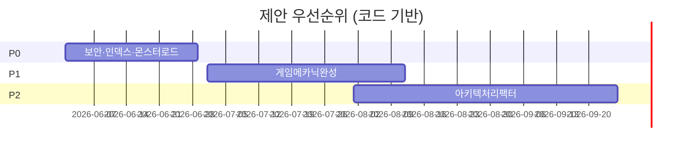

# 10. TODO and Roadmap

> 코드 TODO/FIXME·미완성 기능 기준 (2026-06-14)  
> 우선순위: **P0** 출시 차단 · **P1** MVP 품질 · **P2** 개선

---

## P0 — 출시/안정성

| 우선순위 | 작업 | 근거 파일 | 영향 범위 | 예상 작업 | 비고 |
|----------|------|----------|----------|----------|------|
| P0 | JWT_SECRET 운영 교체 | `auth.py`, `auth_google.py` | 전체 인증 | 0.5일 | env 검증 추가 |
| P0 | Debug/Ops 엔드포인트 보호 | `debug_db.py`, `migrate.py` | 보안 | 1일 | |
| P0 | 게임 턴 몬스터 스냅샷 | `game_turn.py` L148 | 전투 HUD | 1~2일 | TODO 주석 |
| P0 | LLM JSON 실패 대응 | `game_turn.py` | 게임 플레이 | 2~3일 | 재시도/structured |
| P0 | MongoDB 인덱스 갭 | `startup.py` | 성능·중복 | 1일 | users, worlds 등 |

---

## P1 — MVP 기능 완성

| 우선순위 | 작업 | 근거 파일 | 영향 범위 | 예상 작업 | 비고 |
|----------|------|----------|----------|----------|------|
| P1 | items_add 적용 | `game_turn.py` | 인벤토리 | 2일 | 스키마만 존재 |
| P1 | rules LLM 전달 | `trpg_game_master.py` | 룰 일관성 | 2~3일 | 또는 MVP 제외 |
| P1 | 전투 종료 서버 검증 | `game_turn.py` | combat | 2일 | LLM trust 제거 |
| P1 | Favorite API | `my_list.html` | My List | 3일+ | API 없음 |
| P1 | Chat V2 FE 연결 확정 | `chat_v2.py` | 채팅 | 1일 조사 | |
| P1 | engine_input 정리 | `game_turn.py` | 유지보수 | 0.5일 | dead code |

---

## P2 — 개선·리팩터

| 우선순위 | 작업 | 근거 파일 | 영향 범위 | 예상 작업 | 비고 |
|----------|------|----------|----------|----------|------|
| P2 | Route→Usecase 이관 | `USECASE_REFACTOR_ROADMAP.md` | 아키텍처 | 장기 | 신규만 |
| P2 | game.html 모듈 분리 | `game.html` | FE | 1주 | 2700줄 |
| P2 | RAG 재활성화 | `app_chat.py` | 채팅 품질 | 3일+ | Qdrant |
| P2 | Stripe / Admin | SSOT | 수익·운영 | 장기 | 미구현 |
| P2 | 통합 테스트 | `tests/` | CI | 1주 | |
| P2 | phase FSM | `schemas/game_turn.py` | 엔진 | 1주+ | |

---

## 코드 내 TODO/FIXME 목록

| 파일 | 내용 |
|------|------|
| `game_turn.py:148` | 몬스터 정보 스냅샷 변환 |
| `game_events.py:11` | area_type 실제 판정 |
| `game_events.py:108` | rules 몬스터 정의 참조 |
| `auth.py:33` | JWT_SECRET 프로덕션 시크릿 |
| `game.html:1455,1503` | 페르소나 롤백 |
| `html/app/web/src/App.tsx` | routes placeholder |

---

## 권장 로드맵 (제안)

> 일정은 코드 근거 없는 **제안**이며 확정 일정이 아님.

---

## 분석 기준 파일

- Grep `TODO|FIXME|DEPRECATED` across repo
- `docs/USECASE_REFACTOR_ROADMAP.md`, `docs/analysis/*.md`
