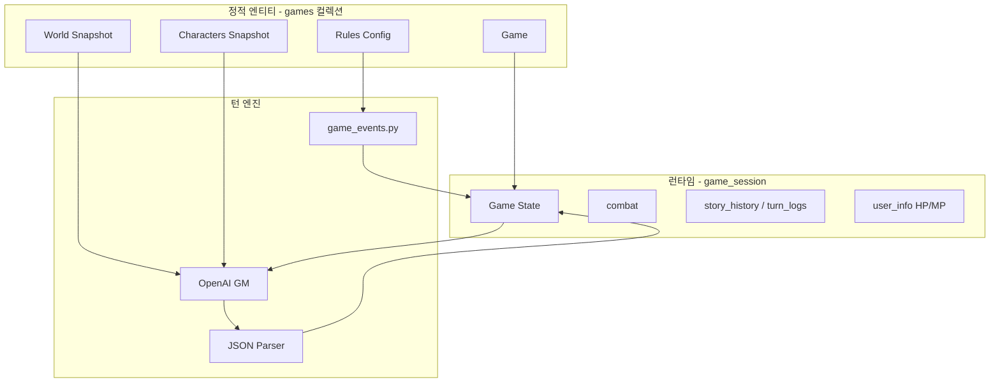
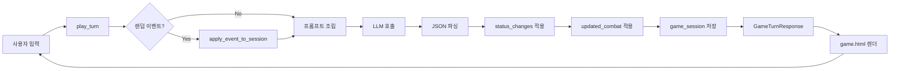
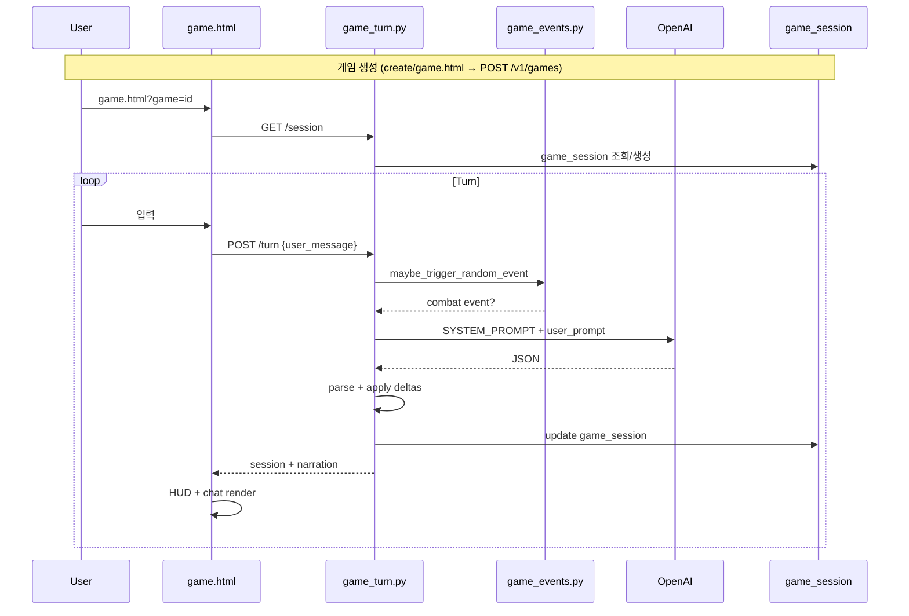

# 13. TRPG Engine

> Arcanaverse TRPG 게임 엔진 — **코드 기준** 상세 분석 (2026-06-14)  
> 관련 분석: `docs/analysis/trpg-llm-narrative-event-separation-analysis.md`, `trpg-state-machine-agent-workflow-analysis.md`

---

## 1. 엔진의 목적

TRPG 엔진은 **일반 CRUD와 달리** 매 사용자 입력마다:

1. 현재 **Game State**를 읽고
2. **LLM**에 맥락을 전달해 서사·이벤트를 생성하고
3. **상태 변화**를 세션에 반영한 뒤
4. **HUD·채팅**에 렌더링한다.

코드상 핵심 진입점: `POST /v1/games/{game_id}/turn` (`apps/api/routes/game_turn.py`)

---

## 2. 일반 CRUD와의 차이

| 구분 | CRUD (캐릭터/세계관) | TRPG 엔진 (게임 턴) |
|------|---------------------|-------------------|
| 저장소 | `characters`, `worlds`, `games` | `game_session` (런타임) |
| 응답 | 정적 JSON | LLM 생성 JSON |
| 상태 | 문서 필드 직접 수정 | `status_changes` delta 적용 |
| 서사 | DB 텍스트 필드 | `narration`, `dialogues` |
| 규칙 | 저장만 | `rules.events` 일부만 서버 실행 |

---

## 3. 핵심 구성요소



| 구성요소 | 코드 위치 | 역할 |
|----------|----------|------|
| **Game** | `games` 컬렉션, `models/games.py` | 시나리오·rules·스냅샷 템플릿 |
| **Character** | `characters`, `games.characters[]` | PC/NPC 메타 |
| **NPC** | `game_session.characters_info` | 동료 스냅샷 + HP |
| **World** | `games.world_snapshot` | 세계관 요약 |
| **Rule** | `games.rules` | dice/damage/events (저장만, 실행 제한적) |
| **Chat** | `turn_logs`, `dialogues` | 턴 대화 |
| **HUD** | `session.player`, `session.npcs` | HP/MP/Gold |
| **Game State** | `game_session` | 턴·전투·스토리 |
| **Event** | `game_events` + `updated_combat` | 전투 시작/갱신 |
| **LLM** | `trpg_game_master.py` | GM 응답 생성 |

---

## 4. 게임 루프



---

## 5. 턴 처리 (`play_turn`)

**파일:** `apps/api/routes/game_turn.py`

| 단계 | 동작 | 파일 |
|------|------|------|
| 1 | `game_session` 로드 (`owner_ref_info.user_ref_id`) | `game_turn.py` |
| 2 | `maybe_trigger_random_event()` | `game_events.py` |
| 3 | `GameSessionSnapshot` 변환 | `game_turn.py` |
| 4 | `build_trpg_user_prompt()` + session_state_text | `trpg_game_master.py` |
| 5 | `generate_chat_completion` (gpt-4o-mini) | `llm_client.py` |
| 6 | `GameTurnLLMResponse` 파싱 (3단계 폴백) | `game_turn.py` |
| 7 | HP/MP/gold delta, combat 갱신 | `game_turn.py` |
| 8 | MongoDB `$set` | `game_session` |

---

## 6. 룰 적용 방식

### 6.1 DB에 저장되는 rules (`GameRulesConfig`)

**파일:** `apps/api/models/games.py`, `create/game.html`

| 필드 | UI 입력 | 서버 실행 |
|------|---------|----------|
| `success_base`, `difficulty_mod` | ✅ | **미구현** |
| `dice` (count, faces) | ✅ | **미구현** |
| `damage` (str_multiplier 등) | ✅ | **미구현** |
| `critical` | ✅ | **미구현** |
| `attributes` (hp/mp max/base) | ✅ | 세션 **초기화**만 (`games.py`) |
| `events` (base_chance, combat_weights) | ✅ 자동 추가 | `game_events.py` **확률 판정** |

### 6.2 HP / MP / Damage

| 메커닉 | 구현 |
|--------|------|
| HP/MP 초기값 | `rules.attributes` → `user_info` (`games.py` 세션 생성) |
| HP/MP 변화 | LLM `status_changes.hp_delta` → 클램프 적용 (`game_turn.py`) |
| Damage 공식 | **미구현** — LLM이 delta로 임의 지정 |
| Dice 롤 | **미구현** — `game_events`만 1~100 주사위 |
| Success Rate | **미구현** |

---

## 7. LLM 응답 ↔ 게임 상태

### 7.1 서사 vs 이벤트 분리

**방식:** 단일 JSON, 필드 분리 (regex 파싱 아님)

| 필드 | 유형 | UI |
|------|------|-----|
| `narration` | 서사 | `#game-narration` |
| `dialogues[]` | 서사 | `#chat` 버블 |
| `status_changes` | 이벤트 | 서버 적용 → HUD |
| `updated_combat` | 이벤트 | `combat` 저장 |

**스키마:** `apps/api/schemas/game_turn.py` — `GameTurnLLMResponse`  
**프롬프트:** `apps/llm/prompts/trpg_game_master.py`

### 7.2 JSON 예시 (프롬프트 정의)

```json
{
  "narration": "상황 요약",
  "dialogues": [{"speaker_type": "npc", "speaker_id": 1, "text": "...", "is_action": false}],
  "status_changes": {
    "user": {"hp_delta": -10, "mp_delta": 0, "items_add": [], "items_remove": [], "gold_delta": 0},
    "characters": []
  },
  "updated_combat": {"in_combat": false, "monsters": [], "phase": "end"}
}
```

### 7.3 파싱 폴백

1. `model_validate_json(raw)`
2. `extract_json()` 후 재시도
3. `build_fallback_llm_response()` — narration만, delta=0

---

## 8. State Machine 여부

| 항목 | 상태 |
|------|------|
| 명시적 FSM 클래스 | **없음** |
| `combat.phase` enum | 스키마·프롬프트에만 (`none/start/player_turn/npc_turn/end`) |
| `phase` 비즈니스 로직 | **미연결** |
| `in_combat` boolean | 서버 이벤트 + LLM `updated_combat` |
| 탐험/대화 모드 state | **없음** (`in_combat=false` = 「평화」) |

**전투 종료 판단:** LLM `in_combat: false` — 서버 검증 **없음**

---

## 9. Frontend / Backend / DB 매핑

| 레이어 | 파일 | 컬렉션 |
|--------|------|--------|
| UI | `apps/web-html/game.html`, `js/game_turn.js` | — |
| API | `game_turn.py`, `games.py` | `games`, `game_session` |
| Service | `game_events.py`, `game_session.py` | — |
| Schema | `schemas/game_turn.py`, `models/games.py` | — |
| Prompt | `llm/prompts/trpg_game_master.py` | — |
| LLM | `adapters/external/llm_client.py` | — |

---

## 10. 구현됨 vs 미구현

### 구현됨

- [x] 게임 생성 + world/character 스냅샷
- [x] `game_session` 런타임 저장
- [x] 턴 API + LLM JSON
- [x] HP/MP/gold delta 적용
- [x] 랜덤 전투 이벤트 (확률)
- [x] HUD·내레이션·채팅 렌더
- [x] 페르소나 게임 연동

### 미구현 / 부분

- [ ] rules 기반 주사위·데미지·성공률 실행
- [ ] `items_add`/`items_remove` 턴 적용
- [ ] 경험치(exp)
- [ ] 명시적 phase FSM
- [ ] 서버 전투 종료 판정
- [ ] 몬스터 스냅샷 로드 (`game_turn.py` L148 TODO)
- [ ] `rules` LLM 프롬프트 전달
- [ ] 게임 종료 UI

---

## 11. 엔진 관점 최대 리스크

| 리스크 | 심각도 | 근거 |
|--------|--------|------|
| LLM JSON 파싱 실패 → 이벤트 소실 | P0 | `build_fallback_llm_response` |
| 서사-스탯 불일치 (narration vs delta) | P1 | 교차검증 없음 |
| 이중 writer (서버 이벤트 + LLM combat) | P1 | `game_events.py` + `updated_combat` |
| rules 저장 vs 실행 괴리 | P1 | UI는 완전, 실행은 events만 |
| 몬스터 HUD/스냅샷 누락 | P1 | `_convert_game_session` TODO |

---

## 12. 전체 시퀀스



---

## 분석 기준 파일

- `apps/api/routes/game_turn.py`, `games.py`
- `apps/api/services/game_events.py`, `game_session.py`
- `apps/api/schemas/game_turn.py`, `models/games.py`
- `apps/llm/prompts/trpg_game_master.py`
- `apps/web-html/game.html`, `js/game_turn.js`
- `docs/analysis/trpg-*.md`
